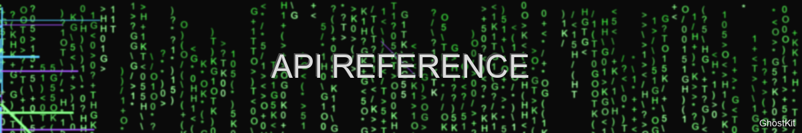

# API Reference



> "The most powerful weapons are those that can be wielded programmatically" — GhostKit Developer Manifesto

## Overview

GhostKit provides a comprehensive REST API and Python SDK for automation, integration, and extension. This reference documents all available endpoints, methods, parameters, and response formats.

## Authentication

All API requests require authentication using API keys:

```bash
curl -X GET https://localhost:6781/api/v1/modules \
  -H "Content-Type: application/json" \
  -H "X-API-Key: YOUR_API_KEY_PLACEHOLDER"
```

Generate an API key:

```bash
python ghostkit.py --generate-api-key --user admin --permissions full
```

## API Endpoints

### Core API

#### System Status

```http
GET /api/v1/status
```

Response:
```json
{
  "status": "operational",
  "version": "3.1.4",
  "uptime": 86400,
  "modules_loaded": 42,
  "tasks_running": 2
}
```

#### Module Management

List available modules:
```http
GET /api/v1/modules
```

Response:
```json
{
  "modules": [
    {
      "name": "network_scanner",
      "description": "Network discovery and enumeration module",
      "version": "1.2.3",
      "category": "reconnaissance",
      "parameters": [
        {
          "name": "target",
          "type": "string",
          "required": true,
          "description": "Target IP or network range (CIDR notation)"
        },
        {
          "name": "scan_type",
          "type": "string",
          "required": false,
          "default": "basic",
          "enum": ["basic", "full", "stealth"],
          "description": "Type of scan to perform"
        }
      ]
    },
    // Other modules...
  ]
}
```

Get module details:
```http
GET /api/v1/modules/{module_name}
```

Response:
```json
{
  "name": "web_scanner",
  "description": "Web application vulnerability scanner",
  "version": "2.1.0",
  "category": "web",
  "parameters": [
    {
      "name": "url",
      "type": "string",
      "required": true,
      "description": "Target URL to scan"
    },
    {
      "name": "scan_depth",
      "type": "integer",
      "required": false,
      "default": 2,
      "description": "Depth of crawling (1-5)"
    },
    {
      "name": "modules",
      "type": "array",
      "items": {
        "type": "string",
        "enum": ["sqli", "xss", "csrf", "ssrf", "xxe", "all"]
      },
      "required": false,
      "default": ["all"],
      "description": "Vulnerability modules to enable"
    }
  ],
  "examples": [
    {
      "description": "Basic scan of a web application",
      "command": "curl -X POST https://localhost:6781/api/v1/tasks -H \"Content-Type: application/json\" -H \"X-API-Key: YOUR_API_KEY_PLACEHOLDER\" -d '{\"module\": \"web_scanner\", \"parameters\": {\"url\": \"https://example.com\", \"modules\": [\"sqli\", \"xss\"]}}'",
      "request": {
        "module": "web_scanner",
        "parameters": {
          "url": "https://example.com",
          "modules": ["sqli", "xss"]
        }
      }
    }
  ]
}
```

### Task Management

Create a new task:
```http
POST /api/v1/tasks
```

Request:
```json
{
  "module": "network_scanner",
  "parameters": {
    "target": "192.168.1.0/24",
    "scan_type": "stealth"
  },
  "name": "Internal Network Scan",
  "tags": ["internal", "discovery"],
  "schedule": {
    "type": "once",
    "start_time": "2025-06-01T22:00:00Z"
  }
}
```

Response:
```json
{
  "task_id": "12345678-1234-5678-1234-567812345678",
  "status": "scheduled",
  "created_at": "2025-05-30T20:45:12Z",
  "scheduled_at": "2025-06-01T22:00:00Z"
}
```

Get task status:
```http
GET /api/v1/tasks/{task_id}
```

Response:
```json
{
  "task_id": "12345678-1234-5678-1234-567812345678",
  "module": "network_scanner",
  "parameters": {
    "target": "192.168.1.0/24",
    "scan_type": "stealth"
  },
  "status": "running",
  "progress": 47,
  "created_at": "2025-05-30T20:45:12Z",
  "started_at": "2025-06-01T22:00:00Z",
  "estimated_completion": "2025-06-01T22:15:30Z",
  "results": null
}
```

Cancel a task:
```http
DELETE /api/v1/tasks/{task_id}
```

Response:
```json
{
  "task_id": "12345678-1234-5678-1234-567812345678",
  "status": "cancelled",
  "cancelled_at": "2025-06-01T22:05:45Z"
}
```

List all tasks:
```http
GET /api/v1/tasks
```

Parameters:
- `status` (optional): Filter by status (running, completed, failed, scheduled)
- `module` (optional): Filter by module name
- `limit` (optional): Maximum number of tasks to return (default: 100)
- `offset` (optional): Pagination offset (default: 0)

Response:
```json
{
  "tasks": [
    {
      "task_id": "12345678-1234-5678-1234-567812345678",
      "module": "network_scanner",
      "status": "running",
      "progress": 47,
      "created_at": "2025-05-30T20:45:12Z"
    },
    {
      "task_id": "87654321-8765-4321-8765-432187654321",
      "module": "web_scanner",
      "status": "completed",
      "progress": 100,
      "created_at": "2025-05-29T14:30:22Z",
      "completed_at": "2025-05-29T14:45:18Z"
    }
  ],
  "total": 124,
  "limit": 100,
  "offset": 0
}
```

### Results Management

Get task results:
```http
GET /api/v1/tasks/{task_id}/results
```

Response:
```json
{
  "task_id": "87654321-8765-4321-8765-432187654321",
  "module": "web_scanner",
  "status": "completed",
  "results": {
    "scan_summary": {
      "target": "https://example.com",
      "start_time": "2025-05-29T14:30:22Z",
      "end_time": "2025-05-29T14:45:18Z",
      "duration_seconds": 896,
      "pages_scanned": 42,
      "vulnerabilities_found": 3
    },
    "vulnerabilities": [
      {
        "type": "sql_injection",
        "severity": "high",
        "confidence": "high",
        "location": {
          "url": "https://example.com/product.php?id=1",
          "parameter": "id",
          "method": "GET"
        },
        "description": "Parameter 'id' appears to be vulnerable to SQL injection",
        "evidence": "Response changed when using payload: 1' OR '1'='1",
        "cwe": "CWE-89",
        "remediation": "Use parameterized queries or prepared statements"
      },
      // Other vulnerabilities...
    ],
    "raw_data": {
      "request_stats": {
        "total_requests": 152,
        "average_response_time": 0.23
      }
    }
  }
}
```

Export results:
```http
GET /api/v1/tasks/{task_id}/export
```

Parameters:
- `format` (optional): Export format (json, csv, pdf, xml) - default: json

Response:
```
Binary file data or JSON depending on format
```

### Configuration Management

Get configuration:
```http
GET /api/v1/config
```

Response:
```json
{
  "global": {
    "max_threads": 10,
    "timeout": 30,
    "user_agent": "GhostKit/3.1.4",
    "proxy": null,
    "debug": false
  },
  "modules": {
    "network_scanner": {
      "default_scan_type": "basic",
      "port_timeout": 2,
      "top_ports": 1000
    },
    "web_scanner": {
      "default_depth": 2,
      "request_delay": 0.5,
      "follow_redirects": true
    }
  },
  "api": {
    "port": 6781,
    "enable_ssl": true,
    "allowed_origins": ["localhost", "127.0.0.1"],
    "rate_limit": {
      "requests": 100,
      "period": 60
    }
  }
}
```

Update configuration:
```http
PATCH /api/v1/config
```

Request:
```json
{
  "global": {
    "max_threads": 20,
    "timeout": 45
  },
  "modules": {
    "web_scanner": {
      "request_delay": 0.2
    }
  }
}
```

Response:
```json
{
  "status": "updated",
  "updated_at": "2025-05-30T20:50:15Z"
}
```

## Webhooks

Register a webhook for event notifications:

```http
POST /api/v1/webhooks
```

Request:
```json
{
  "url": "https://example.com/ghostkit-webhook",
  "events": ["task.completed", "task.failed", "vulnerability.high"],
  "secret": "your_webhook_secret"
}
```

Response:
```json
{
  "webhook_id": "webhook_12345",
  "status": "active",
  "created_at": "2025-05-30T20:52:30Z"
}
```

Test a webhook:
```http
POST /api/v1/webhooks/{webhook_id}/test
```

Response:
```json
{
  "webhook_id": "webhook_12345",
  "test_status": "success",
  "test_time": "2025-05-30T20:53:12Z",
  "response_code": 200,
  "response_time_ms": 215
}
```

Delete a webhook:
```http
DELETE /api/v1/webhooks/{webhook_id}
```

Response:
```json
{
  "webhook_id": "webhook_12345",
  "status": "deleted",
  "deleted_at": "2025-05-30T20:55:00Z"
}
```

## Python SDK

GhostKit provides a Python SDK for programmatic access to the API:

```python
from ghostkit import GhostKit

# Initialize the client
client = GhostKit(api_key="your_api_key_here", api_url="https://localhost:6781")

# Run a network scan
task = client.create_task(
    module="network_scanner",
    parameters={
        "target": "192.168.1.0/24",
        "scan_type": "stealth"
    },
    name="Internal Network Scan"
)

# Wait for the task to complete
result = client.wait_for_task(task.task_id, timeout=300)

# Process the results
if result.status == "completed":
    # Print all hosts with open port 22
    for host in result.results.hosts:
        if 22 in host.open_ports:
            print(f"SSH server found at {host.ip}")
            
    # Export the results
    client.export_results(task.task_id, format="pdf", output_file="network_scan.pdf")
```

## Advanced API Usage

### Chaining Operations

Chain multiple modules together in a workflow:

```http
POST /api/v1/workflows
```

Request:
```json
{
  "name": "Full Web Application Assessment",
  "description": "Complete assessment of a web application",
  "steps": [
    {
      "module": "subdomain_enum",
      "parameters": {
        "domain": "example.com",
        "techniques": ["bruteforce", "certificate", "dns"]
      },
      "id": "step_1"
    },
    {
      "module": "port_scanner",
      "parameters": {
        "targets": "{step_1.results.subdomains}",
        "ports": "80,443,8080,8443"
      },
      "id": "step_2"
    },
    {
      "module": "web_scanner",
      "parameters": {
        "urls": "{step_2.results.web_services}",
        "modules": ["all"]
      },
      "id": "step_3"
    }
  ],
  "schedule": {
    "type": "recurring",
    "cron": "0 0 * * 0"  // Weekly on Sunday at midnight
  }
}
```

Response:
```json
{
  "workflow_id": "workflow_12345",
  "status": "created",
  "created_at": "2025-05-30T21:00:00Z",
  "next_run": "2025-06-01T00:00:00Z"
}
```

### Event Streaming

Subscribe to real-time event stream:

```http
GET /api/v1/events/stream
```

Response (Server-Sent Events):
```
event: task.started
data: {"task_id": "12345678-1234-5678-1234-567812345678", "module": "network_scanner", "started_at": "2025-06-01T22:00:00Z"}

event: task.progress
data: {"task_id": "12345678-1234-5678-1234-567812345678", "progress": 25, "message": "Scanning 192.168.1.64/27"}

event: vulnerability.found
data: {"task_id": "87654321-8765-4321-8765-432187654321", "severity": "high", "type": "sql_injection", "target": "https://example.com/product.php"}

event: task.completed
data: {"task_id": "87654321-8765-4321-8765-432187654321", "module": "web_scanner", "completed_at": "2025-05-29T14:45:18Z", "summary": {"vulnerabilities": {"high": 2, "medium": 5, "low": 3}}}
```

### Batch Operations

Create multiple tasks at once:

```http
POST /api/v1/tasks/batch
```

Request:
```json
{
  "tasks": [
    {
      "module": "port_scanner",
      "parameters": {
        "target": "192.168.1.10",
        "ports": "1-1000"
      }
    },
    {
      "module": "port_scanner",
      "parameters": {
        "target": "192.168.1.11",
        "ports": "1-1000"
      }
    },
    {
      "module": "port_scanner",
      "parameters": {
        "target": "192.168.1.12",
        "ports": "1-1000"
      }
    }
  ]
}
```

Response:
```json
{
  "batch_id": "batch_12345",
  "tasks": [
    {
      "task_id": "task_a1b2c3",
      "status": "scheduled"
    },
    {
      "task_id": "task_d4e5f6",
      "status": "scheduled"
    },
    {
      "task_id": "task_g7h8i9",
      "status": "scheduled"
    }
  ]
}
```

## API Client Examples

### cURL

```bash
# Authenticate and get API token (if using token-based auth)
curl -X POST https://localhost:6781/api/v1/auth/login \
  -H "Content-Type: application/json" \
  -d '{"username": "admin", "password": "secure_password"}'

# Run a port scan
curl -X POST https://localhost:6781/api/v1/tasks \
  -H "Content-Type: application/json" \
  -H "X-API-Key: YOUR_API_KEY_PLACEHOLDER" \
  -d '{
    "module": "port_scanner",
    "parameters": {
      "target": "192.168.1.10",
      "ports": "22,80,443,3389",
      "scan_type": "connect"
    }
  }'

# Get the results
curl -X GET https://localhost:6781/api/v1/tasks/task_id/results \
  -H "X-API-Key: YOUR_API_KEY_PLACEHOLDER"
```

### Python Requests

```python
import requests
import json

API_URL = "https://localhost:6781/api/v1"
API_KEY = "your_api_key_here"

headers = {
    "Content-Type": "application/json",
    "X-API-Key": "YOUR_API_KEY_PLACEHOLDER"
}

# Run a web vulnerability scan
data = {
    "module": "web_scanner",
    "parameters": {
        "url": "https://example.com",
        "modules": ["sqli", "xss", "csrf"],
        "scan_depth": 3
    }
}

response = requests.post(f"{API_URL}/tasks", headers=headers, data=json.dumps(data))
task = response.json()
task_id = task["task_id"]

# Poll for results
import time
while True:
    response = requests.get(f"{API_URL}/tasks/{task_id}", headers=headers)
    status = response.json()
    
    if status["status"] in ["completed", "failed"]:
        break
        
    print(f"Task progress: {status.get('progress', 0)}%")
    time.sleep(5)

# Get the results
response = requests.get(f"{API_URL}/tasks/{task_id}/results", headers=headers)
results = response.json()

# Export as PDF
response = requests.get(
    f"{API_URL}/tasks/{task_id}/export?format=pdf",
    headers=headers,
    stream=True
)

with open("scan_results.pdf", "wb") as f:
    for chunk in response.iter_content(chunk_size=1024):
        f.write(chunk)
```

### Node.js

```javascript
const axios = require('axios');
const fs = require('fs');

const API_URL = 'https://localhost:6781/api/v1';
const API_KEY = 'your_api_key_here';

const headers = {
  'Content-Type': 'application/json',
  'X-API-Key': 'YOUR_API_KEY_PLACEHOLDER'
};

// Run a network scan
async function runNetworkScan() {
  try {
    // Create the scan task
    const taskResponse = await axios.post(`${API_URL}/tasks`, {
      module: 'network_scanner',
      parameters: {
        target: '192.168.1.0/24',
        scan_type: 'basic'
      }
    }, { headers });
    
    const taskId = taskResponse.data.task_id;
    console.log(`Scan started with task ID: ${taskId}`);
    
    // Poll for completion
    let completed = false;
    while (!completed) {
      const statusResponse = await axios.get(`${API_URL}/tasks/${taskId}`, { headers });
      const status = statusResponse.data;
      
      console.log(`Task status: ${status.status}, Progress: ${status.progress || 0}%`);
      
      if (status.status === 'completed' || status.status === 'failed') {
        completed = true;
      } else {
        await new Promise(resolve => setTimeout(resolve, 5000));
      }
    }
    
    // Get the results
    const resultsResponse = await axios.get(`${API_URL}/tasks/${taskId}/results`, { headers });
    console.log('Results:', JSON.stringify(resultsResponse.data, null, 2));
    
    // Export as JSON file
    fs.writeFileSync('network_scan_results.json', JSON.stringify(resultsResponse.data, null, 2));
    console.log('Results saved to network_scan_results.json');
    
  } catch (error) {
    console.error('Error:', error.response?.data || error.message);
  }
}

runNetworkScan();
```

## Error Handling

All API errors follow a consistent format:

```json
{
  "error": {
    "code": "invalid_parameter",
    "message": "Parameter 'target' is required",
    "details": {
      "parameter": "target",
      "location": "body"
    },
    "request_id": "req_12345"
  }
}
```

Common error codes:

| Error Code | HTTP Status | Description |
|------------|-------------|-------------|
| `authentication_failed` | 401 | Invalid API key or token |
| `authorization_failed` | 403 | Insufficient permissions |
| `not_found` | 404 | Resource not found |
| `invalid_parameter` | 400 | Invalid parameter value |
| `missing_parameter` | 400 | Required parameter missing |
| `module_error` | 500 | Error in module execution |
| `rate_limited` | 429 | Too many requests |

## API Versioning

The API uses semantic versioning in the URL path (`/api/v1/`). Breaking changes will be introduced in new major versions.

Changes to the API will be documented in the changelog and announced in advance.

## Rate Limiting

API requests are rate-limited to protect server resources:

- 100 requests per minute per API key by default
- Bulk operations count as multiple requests
- Rate limit headers are included in all responses:
  - `X-RateLimit-Limit`: Maximum requests per minute
  - `X-RateLimit-Remaining`: Remaining requests in current window
  - `X-RateLimit-Reset`: Time when the limit resets (Unix timestamp)

When rate limited, the API returns a 429 status code:

```json
{
  "error": {
    "code": "rate_limited",
    "message": "Rate limit exceeded. Please try again later.",
    "details": {
      "limit": 100,
      "reset_at": 1622404800
    }
  }
}
```

## Security Considerations

- Always use HTTPS for API communication
- Store API keys securely, never in client-side code
- Use the principle of least privilege when generating API keys
- Rotate API keys periodically
- Monitor API usage for suspicious activity
- Consider IP restrictions for API access

## SDK Language Support

GhostKit provides official SDK support for:

- Python: `pip install ghostkit-client`
- JavaScript/Node.js: `npm install ghostkit-client`
- Go: `go get github.com/ghostkit/ghostkit-go`
- Ruby: `gem install ghostkit-client`

Community-maintained libraries are available for:

- Java
- C#/.NET
- PHP
- Rust

## OpenAPI Specification

The complete OpenAPI specification (formerly Swagger) is available at:

```
https://localhost:6781/api/v1/docs/openapi.json
```

An interactive API documentation is available at:

```
https://localhost:6781/api/docs
```

## References

- [GhostKit API Development Guide](api-reference.md)
- [GhostKit Integration Examples](../index.md)
- [API Change Log](api-reference.md)
- [API Security Best Practices](../security/gates.md)

---

*Last updated: May 30, 2025*
