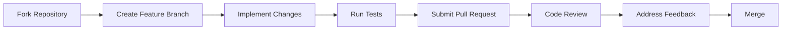

# Developer Contribution Guide


> "Hack the planet, one pull request at a time" — GhostKit Developer Community

## Introduction

This guide will help you contribute to the GhostKit project effectively. Whether you're fixing bugs, adding new offensive security capabilities, or improving documentation, this guide covers the workflow, coding standards, and best practices for contributing to GhostKit.

## Getting Started

### Development Environment Setup

1. **Fork the Repository**
   ```bash
   # Clone your fork
   git clone https://github.com/YOUR-USERNAME/GhostKit-.git
   cd GhostKit-
   
   # Add upstream remote
   git remote add upstream https://github.com/K11E3R/GhostKit-.git
   ```

2. **Create Virtual Environment**
   ```bash
   python -m venv venv
   
   # On Windows
   venv\Scripts\activate
   
   # On Linux/macOS
   source venv/bin/activate
   ```

3. **Install Development Dependencies**
   ```bash
   pip install -r requirements-dev.txt
   ```

4. **Install Pre-commit Hooks**
   ```bash
   pre-commit install
   ```

### Development Workflow



1. **Create a Feature Branch**
   ```bash
   git checkout -b feature/your-feature-name
   ```

2. **Make Your Changes**
   - Write code following the coding standards
   - Add tests for new functionality
   - Update documentation

3. **Commit Your Changes**
   - Follow the [Git Commit Conventions](#git-commit-conventions)
   ```bash
   git add .
   git commit -m "[ADD] module: implement new exploitation technique"
   ```

4. **Push to Your Fork**
   ```bash
   git push origin feature/your-feature-name
   ```

5. **Create a Pull Request**
   - Go to the [GhostKit repository](https://github.com/K11E3R/GhostKit-)
   - Click "New Pull Request"
   - Select "compare across forks"
   - Select your fork and branch
   - Fill out the PR template

## Git Commit Conventions

All commits must follow the format: `[TAG] module: description`

| TAG | Description | Example |
|-----|-------------|---------|
| `ADD` | Adding new features | `[ADD] network: implement parallel nmap scanner` |
| `UPDATE` | Updating existing features | `[UPDATE] readme: update installation instructions` |
| `FIX` | Bug fixes | `[FIX] exploit: correct off-by-one in PoC buffer overflow` |
| `RM` | Removing code | `[RM] old_tool: remove deprecated recon script` |
| `MV` | Moving/renaming | `[MV] utils: refactor helper functions into modules` |
| `DOC` | Documentation changes | `[DOC] README: add usage examples for Mode 5` |

## Coding Standards

### Python Style Guide

GhostKit follows the [Black](https://black.readthedocs.io/) code style with a few additional rules:

1. **Code Formatting**
   - Use Black with line length of 88 characters
   - Use isort for import sorting
   
2. **Naming Conventions**
   - Classes: `CamelCase`
   - Functions/Methods: `snake_case`
   - Variables: `snake_case`
   - Constants: `UPPER_SNAKE_CASE`
   - Private attributes/methods: `_leading_underscore`
   
3. **Documentation**
   - All modules, classes, and methods must have docstrings
   - Follow Google docstring format

```python
def exploit_vulnerability(target: str, payload: bytes, timeout: int = 30) -> ExploitResult:
    """Exploits a vulnerability on the target system.
    
    This function attempts to exploit a known vulnerability by
    sending a specially crafted payload to the target.
    
    Args:
        target: The target IP address or hostname
        payload: The exploit payload to send
        timeout: Timeout in seconds (default: 30)
        
    Returns:
        ExploitResult: Object containing exploit results
        
    Raises:
        ConnectionError: If the target is unreachable
        TimeoutError: If the exploit times out
        
    Example:
        >>> result = exploit_vulnerability("192.168.1.100", payload_bytes)
        >>> if result.success:
        ...     print(f"Exploitation successful! Got shell on port {result.shell_port}")
    """
    # Implementation...
```

### Code Organization

```
ghostkit/
├── core/             # Core framework components
├── modules/          # Attack/security modules
│   ├── recon/        # Reconnaissance modules
│   ├── web/          # Web attack modules
│   ├── network/      # Network attack modules
│   ├── wireless/     # Wireless attack modules
│   ├── hardware/     # Hardware attack modules
│   └── post/         # Post-exploitation modules
├── utils/            # Utility functions
├── data/             # Static data files
├── interface/        # User interface code
└── tests/            # Test suite
```

### Security Considerations

1. **Avoid Hardcoded Secrets**
   - No API keys, passwords, or tokens in code
   - Use environment variables or secure storage

2. **Input Validation**
   - Validate all user inputs
   - Sanitize data coming from external sources

3. **Error Handling**
   - Implement proper exception handling
   - Do not expose sensitive information in error messages

4. **Code Security**
   - No backdoors or undocumented features
   - All capabilities must be transparent and documented

## Testing

### Writing Tests

GhostKit uses pytest for testing. Every module should have corresponding tests:

```python
# tests/modules/test_exploit_module.py
import pytest
from ghostkit.modules.exploit import ExploitModule

@pytest.fixture
def exploit_module():
    return ExploitModule()

def test_exploit_validation(exploit_module):
    """Test that the exploit properly validates inputs."""
    with pytest.raises(ValueError):
        exploit_module.validate_target("not-a-valid-target")
    
    assert exploit_module.validate_target("192.168.1.1") is True

def test_exploit_execution(exploit_module, mocker):
    """Test that the exploit executes correctly."""
    # Mock network calls
    mock_socket = mocker.patch("socket.socket")
    mock_socket.return_value.recv.return_value = b"Shell connected"
    
    result = exploit_module.run(target="192.168.1.1", payload=b"TEST")
    
    assert result.success is True
    assert result.shell_connected is True
```

### Running Tests

```bash
# Run all tests
python -m pytest

# Run specific test file
python -m pytest tests/modules/test_exploit_module.py

# Run with coverage
python -m pytest --cov=ghostkit

# Generate coverage report
python -m pytest --cov=ghostkit --cov-report=html
```

## Documentation

All code contributions should include appropriate documentation:

1. **Code Documentation**
   - Docstrings for all modules, classes, and methods
   - Inline comments for complex logic

2. **Module Documentation**
   - Create a markdown file in `docs/modules/` for each new module
   - Include usage examples, parameters, and sample output

3. **API Documentation**
   - Document all public APIs following OpenAPI standards
   - Update API reference when changing interfaces

## Pull Request Process

### PR Checklist

Before submitting a pull request, ensure:

- [ ] Code follows the style guidelines
- [ ] All tests pass
- [ ] New functionality includes tests
- [ ] Documentation is updated
- [ ] Commit messages follow conventions
- [ ] No sensitive information is included

### Review Process

1. **Initial Review**
   - Automated checks (linting, tests, security scans)
   - Initial maintainer review

2. **Feedback Phase**
   - Address reviewer comments
   - Make requested changes

3. **Final Approval**
   - Maintainer approves changes
   - Changes are merged

## Module Development

### Module Structure

New modules should follow this structure:

```python
from typing import Dict, List, Optional, Any
from ghostkit.core.module import BaseModule
from ghostkit.core.result import ModuleResult

class NewExploitModule(BaseModule):
    """Exploits a specific vulnerability in target systems.
    
    This module implements an exploit for CVE-XXXX-XXXXX,
    allowing for remote code execution on vulnerable systems.
    """
    
    name = "new_exploit"
    description = "Exploits CVE-XXXX-XXXXX for remote code execution"
    author = "Your Name"
    references = [
        "https://cve.mitre.org/cgi-bin/cvename.cgi?name=CVE-XXXX-XXXXX",
        "https://example.com/detailed-writeup"
    ]
    
    def _create_arg_parser(self):
        """Create argument parser for this module."""
        parser = super()._create_arg_parser()
        parser.add_argument("-t", "--target", required=True, help="Target IP or hostname")
        parser.add_argument("-p", "--port", type=int, default=80, help="Target port")
        parser.add_argument("-v", "--verbose", action="store_true", help="Enable verbose output")
        return parser
    
    def run(self, args: List[str]) -> ModuleResult:
        """Run the exploit module with the given arguments."""
        parsed_args = self.args_parser.parse_args(args)
        
        # Implementation logic
        self.logger.info(f"Targeting {parsed_args.target}:{parsed_args.port}")
        
        # Execute exploit
        result = self._exploit(parsed_args.target, parsed_args.port)
        
        return ModuleResult(
            success=result["success"],
            data=result["data"],
            message=result["message"]
        )
    
    def _exploit(self, target: str, port: int) -> Dict[str, Any]:
        """Core exploit implementation."""
        # Detailed exploit implementation
        pass
```

### Module Requirements

All modules must:

1. **Be self-contained** - Minimize dependencies
2. **Include documentation** - Both docstrings and standalone docs
3. **Implement proper logging** - Use the module's logger
4. **Handle errors gracefully** - No uncaught exceptions
5. **Support verbose mode** - Detailed output when requested
6. **Return standardized results** - Use ModuleResult objects

## Plugin Development

### Plugin Structure

Plugins extend GhostKit functionality without modifying core code:

```
plugin_name/
├── __init__.py          # Plugin initialization
├── metadata.json        # Plugin metadata
├── modules/             # Plugin-specific modules
├── resources/           # Additional resources
└── README.md            # Plugin documentation
```

### Plugin Metadata

```json
{
  "name": "plugin_name",
  "version": "1.0.0",
  "author": "Your Name",
  "email": "your.email@example.com",
  "description": "Plugin description",
  "entry_point": "plugin_name.__init__",
  "dependencies": [
    "requests>=2.25.0",
    "cryptography>=3.4.0"
  ],
  "compatibility": "3.1.0",
  "category": "exploitation"
}
```

### Plugin Registration

```python
# __init__.py
from ghostkit.core.plugin import register_plugin
from .modules import CustomModule1, CustomModule2

def initialize():
    """Initialize the plugin."""
    register_plugin(
        name="plugin_name",
        modules=[CustomModule1, CustomModule2],
        hooks={
            "pre_scan": pre_scan_hook,
            "post_exploit": post_exploit_hook
        }
    )
    
def pre_scan_hook(context):
    """Hook that runs before scanning."""
    pass

def post_exploit_hook(context, result):
    """Hook that runs after exploitation."""
    pass
```

## Quality Assurance

### Static Analysis

GhostKit uses several static analysis tools:

```bash
# Run Bandit security analysis
bandit -r ghostkit/

# Run flake8 linting
flake8 ghostkit/ tests/

# Run mypy type checking
mypy ghostkit/
```

### Security Testing

All code undergoes security review:

```bash
# Scan for hardcoded secrets
gitleaks detect --source .

# Scan for known vulnerabilities in dependencies
safety check

# Run SAST (Static Application Security Testing)
bandit -r ghostkit/ -f json -o bandit-results.json
```

## Community Guidelines

### Communication Channels

- **GitHub Issues**: Bug reports, feature requests
- **Pull Requests**: Code contributions
- **Discord Server**: Real-time discussions
- **Mailing List**: Announcements and discussions

### Code of Conduct

All contributors must adhere to the [Code of Conduct](../community/code-of-conduct.md), which promotes:

- Respectful and inclusive communication
- Constructive feedback
- Collaborative problem-solving
- Focus on technical merit

### Recognition

Contributors are recognized through:

- Attribution in code (author credits)
- Mention in release notes
- Recognition on the contributors page
- Opportunities for maintainership

## Frequently Asked Questions

### How do I report security vulnerabilities?

Please report security issues privately to `security@ghostkit.io`. Do not disclose security vulnerabilities publicly until they have been addressed.

### How can I propose major changes?

Major changes should start with a Request for Comments (RFC) document submitted as an issue on GitHub. This allows discussion before significant development effort.

### What if I need help?

- Ask questions in the GitHub Discussions
- Join the Discord server for real-time help
- Check the documentation for guides
- Review existing issues for similar problems

## Resources

- [GhostKit Architecture](../core-concepts/architecture.md)
- [API Reference](api-reference.md)
- [Module System](module-system.md)
- [Developer Tools](developer-tools.md)

---

*Last updated: May 30, 2025*
