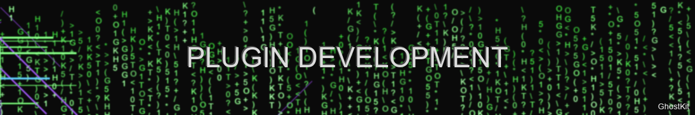
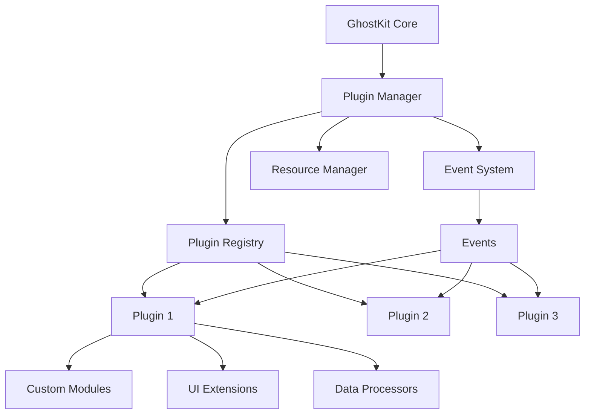

# Plugin Development Framework



> "Extensibility is the key to longevity" — GhostKit Plugin Architecture

## Introduction

GhostKit's plugin architecture allows security researchers to extend its capabilities with custom offensive modules, post-exploitation tools, and integrations. This guide provides a comprehensive walkthrough of the plugin development process, from basic structure to advanced integrations.

## Plugin System Architecture

GhostKit implements a flexible, event-driven plugin system:



### Key Components

1. **Plugin Manager** - Core system that loads, manages, and unloads plugins
2. **Plugin Registry** - Central repository of registered plugins
3. **Event System** - Facilitates communication between plugins and core
4. **Resource Manager** - Handles shared resources and dependencies

## Creating Your First Plugin

### Plugin Structure

A basic GhostKit plugin has this structure:

```
my_awesome_plugin/
├── __init__.py         # Plugin entry point
├── metadata.json       # Plugin metadata
├── modules/            # Custom modules
│   ├── __init__.py
│   └── awesome_module.py
├── resources/          # Additional resources
│   └── wordlists/
│       └── custom_wordlist.txt
└── README.md           # Plugin documentation
```

### Metadata Definition

Every plugin needs a `metadata.json` file:

```json
{
  "name": "my_awesome_plugin",
  "version": "1.0.0",
  "author": "Your Name",
  "email": "you@example.com",
  "website": "https://github.com/yourusername/my_awesome_plugin",
  "description": "A plugin that adds awesome new capabilities to GhostKit",
  "license": "MIT",
  "min_ghostkit_version": "3.0.0",
  "max_ghostkit_version": "4.0.0",
  "dependencies": [
    "requests>=2.25.0",
    "cryptography>=3.4.0"
  ],
  "tags": ["exploitation", "web", "reconnaissance"],
  "entry_point": "my_awesome_plugin"
}
```

### Plugin Initialization

The `__init__.py` file serves as the entry point:

```python
# my_awesome_plugin/__init__.py
from ghostkit.core.plugin import register_plugin
from .modules.awesome_module import AwesomeModule

def initialize():
    """Initialize the plugin."""
    register_plugin(
        name="my_awesome_plugin",
        modules=[AwesomeModule],
        hooks={
            "pre_scan": pre_scan_hook,
            "post_exploitation": post_exploitation_hook
        },
        ui_extensions={
            "main_menu": {
                "name": "Awesome Plugin",
                "icon": "bolt",
                "command": "awesome"
            }
        }
    )
    
def pre_scan_hook(context):
    """Hook called before scanning operations."""
    context.logger.info("Awesome plugin is preparing for scanning!")
    
def post_exploitation_hook(context, result):
    """Hook called after exploitation."""
    context.logger.info(f"Exploitation completed with result: {result.success}")
    
    if result.success:
        # Do something with successful exploitation
        pass
```

### Creating a Custom Module

Define your module in the modules directory:

```python
# my_awesome_plugin/modules/awesome_module.py
from typing import List, Dict, Any
from ghostkit.core.module import BaseModule
from ghostkit.core.result import ModuleResult

class AwesomeModule(BaseModule):
    """A module that does awesome things.
    
    This module implements a custom attack technique
    targeting specific vulnerabilities in web applications.
    """
    
    name = "awesome_attack"
    description = "Performs an awesome attack against target systems"
    author = "Your Name"
    references = [
        "https://example.com/awesome_attack_details",
        "https://cve.mitre.org/cgi-bin/cvename.cgi?name=CVE-XXXX-XXXXX"
    ]
    
    def _create_arg_parser(self):
        """Create argument parser for this module."""
        parser = super()._create_arg_parser()
        parser.add_argument("-t", "--target", required=True, help="Target URL or IP")
        parser.add_argument("-p", "--port", type=int, default=80, help="Target port")
        parser.add_argument("--awesome-level", type=int, default=5, choices=range(1, 11),
                            help="Level of awesomeness (1-10)")
        return parser
    
    def run(self, args: List[str]) -> ModuleResult:
        """Run the module with the given arguments."""
        parsed_args = self.args_parser.parse_args(args)
        
        self.logger.info(f"Executing awesome attack against {parsed_args.target}:{parsed_args.port}")
        self.logger.info(f"Awesomeness level: {parsed_args.awesome_level}")
        
        # Execute the attack
        result = self._execute_attack(
            target=parsed_args.target,
            port=parsed_args.port,
            awesome_level=parsed_args.awesome_level
        )
        
        return ModuleResult(
            success=result["success"],
            data=result["data"],
            message=result["message"]
        )
    
    def _execute_attack(self, target: str, port: int, awesome_level: int) -> Dict[str, Any]:
        """Execute the actual attack logic."""
        # Implement your attack logic here
        # ...
        
        # For demonstration:
        return {
            "success": True,
            "data": {
                "target": target,
                "port": port,
                "vulnerabilities_found": awesome_level * 2,
                "exploit_success": True
            },
            "message": f"Successfully executed awesome attack against {target}:{port}"
        }
```

### Installing Your Plugin

Plugins can be installed from local or remote sources:

```bash
# Install from local directory
python ghostkit.py --install-plugin /path/to/my_awesome_plugin

# Install from Git repository
python ghostkit.py --install-plugin https://github.com/yourusername/my_awesome_plugin.git

# Install from plugin registry
python ghostkit.py --install-plugin my_awesome_plugin
```

## Advanced Plugin Development

### Event System Integration

Plugins can subscribe to events and trigger actions:

```python
from ghostkit.core.events import EventType, subscribe, publish

# Subscribe to an event
@subscribe(EventType.TARGET_DISCOVERED)
def handle_target_discovered(event_data):
    """Handle target discovery event."""
    target_info = event_data["target"]
    print(f"Target discovered: {target_info['ip']} running {target_info['os']}")
    
    # Perform custom actions based on target info
    if "windows" in target_info["os"].lower():
        # Trigger windows-specific modules
        pass

# Publish a custom event
def notify_custom_vulnerability(target, vuln_type, details):
    """Notify the system about a custom vulnerability."""
    publish(
        event_type=EventType.VULNERABILITY_FOUND,
        data={
            "target": target,
            "type": vuln_type,
            "details": details,
            "source": "awesome_plugin"
        }
    )
```

### Custom UI Components

For plugins with GUI elements:

```python
from ghostkit.interface.ui import register_component, ComponentType

# Register a custom dashboard widget
register_component(
    component_type=ComponentType.DASHBOARD_WIDGET,
    name="awesome_stats",
    title="Awesome Attack Statistics",
    render_function=render_stats_widget,
    update_interval=30,  # seconds
    size="medium"
)

def render_stats_widget(context):
    """Render the awesome stats widget."""
    stats = get_awesome_stats()
    
    return {
        "type": "stats",
        "items": [
            {"label": "Attacks Executed", "value": stats["attack_count"]},
            {"label": "Success Rate", "value": f"{stats['success_rate']}%"},
            {"label": "Vulnerabilities Found", "value": stats["vuln_count"]}
        ]
    }
```

### Data Processors

Plugins can process and transform data:

```python
from ghostkit.core.data import register_processor, DataType

@register_processor(data_type=DataType.SCAN_RESULT)
def process_scan_results(data, context):
    """Process scan results for enhanced analysis."""
    # Enrich data with additional information
    for target in data["targets"]:
        # Add custom threat scoring
        threat_score = calculate_threat_score(target)
        target["threat_score"] = threat_score
        
        # Add custom tags
        target["tags"] = identify_target_tags(target)
    
    return data

def calculate_threat_score(target):
    """Calculate a custom threat score based on target properties."""
    # Implementation...
    return score

def identify_target_tags(target):
    """Identify relevant tags for the target."""
    # Implementation...
    return tags
```

### Custom Report Generators

Create specialized reports from plugin data:

```python
from ghostkit.core.reporting import register_report_generator

@register_report_generator(name="awesome_report")
def generate_awesome_report(data, options):
    """Generate a specialized report for awesome attacks."""
    report = {
        "title": "Awesome Attack Report",
        "timestamp": datetime.now().isoformat(),
        "summary": {
            "targets_analyzed": len(data["targets"]),
            "vulnerabilities_found": sum(t["vuln_count"] for t in data["targets"]),
            "exploitation_success_rate": calculate_success_rate(data)
        },
        "detailed_findings": generate_detailed_findings(data),
        "remediation_recommendations": generate_recommendations(data)
    }
    
    # Apply formatting based on options
    if options.get("format") == "pdf":
        return generate_pdf(report)
    elif options.get("format") == "html":
        return generate_html(report)
    else:
        return report
```

## Integration with Core Components

### Payload Generation

Integrate with the payload generation system:

```python
from ghostkit.core.payload import register_payload_generator, PayloadType

@register_payload_generator(payload_type=PayloadType.SHELLCODE)
class AwesomeShellcodeGenerator:
    """Generates awesome shellcode for various platforms."""
    
    name = "awesome_shellcode"
    supported_platforms = ["windows", "linux", "macos"]
    supported_architectures = ["x86", "x64"]
    
    def generate(self, options):
        """Generate shellcode based on options."""
        platform = options.get("platform", "windows")
        arch = options.get("architecture", "x64")
        
        # Retrieve the appropriate shellcode template
        template = self._get_shellcode_template(platform, arch)
        
        # Customize shellcode based on options
        shellcode = self._customize_shellcode(template, options)
        
        # Apply encoding if requested
        if options.get("encode", False):
            shellcode = self._encode_shellcode(shellcode, options.get("encoder", "xor"))
        
        return {
            "shellcode": shellcode,
            "size": len(shellcode),
            "platform": platform,
            "architecture": arch,
            "encoded": options.get("encode", False)
        }
    
    def _get_shellcode_template(self, platform, arch):
        """Get the base shellcode template."""
        # Implementation...
        
    def _customize_shellcode(self, template, options):
        """Customize shellcode with options like IP, port, etc."""
        # Implementation...
        
    def _encode_shellcode(self, shellcode, encoder):
        """Apply encoding to evade detection."""
        # Implementation...
```

### Custom Exploits

Integrate with the exploit framework:

```python
from ghostkit.core.exploit import register_exploit, ExploitType

@register_exploit(exploit_type=ExploitType.WEB)
class AwesomeExploit:
    """Implements an exploit for a specific vulnerability."""
    
    name = "awesome_web_exploit"
    description = "Exploits a vulnerability in AwesomeApp v1.2.3"
    cve = "CVE-XXXX-XXXXX"
    references = [
        "https://example.com/vulnerability-details",
        "https://github.com/researcher/poc"
    ]
    
    def check(self, target, options=None):
        """Check if the target is vulnerable."""
        # Implementation...
        return vulnerable
    
    def exploit(self, target, options=None):
        """Exploit the vulnerability on the target."""
        # Implementation...
        return result
    
    def cleanup(self, target, session=None):
        """Clean up after exploitation."""
        # Implementation...
```

## Plugin Configuration and State Management

### Configuration Management

Plugins can have their own configuration:

```python
from ghostkit.core.config import register_config_schema

# Define configuration schema
register_config_schema(
    plugin_name="my_awesome_plugin",
    schema={
        "attack_timeout": {
            "type": "integer",
            "default": 30,
            "description": "Timeout in seconds for attack execution"
        },
        "user_agent": {
            "type": "string",
            "default": "Mozilla/5.0 (Windows NT 10.0; Win64; x64) AppleWebKit/537.36",
            "description": "User agent to use for web requests"
        },
        "aggressive_mode": {
            "type": "boolean",
            "default": False,
            "description": "Enable aggressive scanning mode"
        },
        "target_exclusions": {
            "type": "array",
            "items": {
                "type": "string"
            },
            "default": [],
            "description": "IP addresses or domains to exclude from scanning"
        }
    }
)

# Access configuration in your code
from ghostkit.core.config import get_plugin_config

def some_function():
    config = get_plugin_config("my_awesome_plugin")
    timeout = config.get("attack_timeout")
    user_agent = config.get("user_agent")
    # Use configuration values...
```

### State Persistence

Maintain state between sessions:

```python
from ghostkit.core.storage import PluginStorage

class AwesomeModule(BaseModule):
    def __init__(self):
        super().__init__()
        # Initialize storage
        self.storage = PluginStorage("my_awesome_plugin")
    
    def run(self, args):
        # Get previously seen targets
        seen_targets = self.storage.get("seen_targets", [])
        
        # Update with new targets
        target = args.target
        if target not in seen_targets:
            seen_targets.append(target)
            self.storage.set("seen_targets", seen_targets)
            
        # Get success count
        success_count = self.storage.get("success_count", 0)
        
        # Increment on success
        if result["success"]:
            self.storage.set("success_count", success_count + 1)
```

## Plugin Distribution

### Packaging

Package your plugin for distribution:

```bash
# Create a distribution package
python setup.py sdist

# Use the GhostKit packaging tool
python -m ghostkit.tools.package_plugin --path ./my_awesome_plugin --output ./dist
```

Example `setup.py`:

```python
from setuptools import setup, find_packages

setup(
    name="ghostkit-awesome-plugin",
    version="1.0.0",
    packages=find_packages(),
    include_package_data=True,
    install_requires=[
        "requests>=2.25.0",
        "cryptography>=3.4.0"
    ],
    author="Your Name",
    author_email="you@example.com",
    description="An awesome plugin for GhostKit",
    keywords="ghostkit, security, plugin",
    url="https://github.com/yourusername/my_awesome_plugin",
    classifiers=[
        "Development Status :: 4 - Beta",
        "Intended Audience :: Information Technology",
        "License :: OSI Approved :: MIT License",
        "Programming Language :: Python :: 3",
        "Topic :: Security"
    ],
    entry_points={
        "ghostkit.plugins": [
            "my_awesome_plugin=my_awesome_plugin:initialize"
        ]
    }
)
```

### Publishing to the Plugin Registry

Submit your plugin to the official registry:

```bash
# Login to registry
python -m ghostkit.tools.registry login

# Publish plugin
python -m ghostkit.tools.registry publish --path ./dist/ghostkit-awesome-plugin-1.0.0.tar.gz
```

## Debugging and Testing

### Debug Mode

Enable debug mode during development:

```python
# Set up debug logging
import logging

def initialize():
    """Initialize the plugin with debug logging."""
    logger = logging.getLogger("ghostkit.plugins.my_awesome_plugin")
    logger.setLevel(logging.DEBUG)
    
    # Debug message
    logger.debug("Initializing my_awesome_plugin in debug mode")
    
    # Register plugin components
    # ...
```

### Testing Framework

Create tests for your plugin:

```python
# tests/test_awesome_module.py
import pytest
from ghostkit.testing import ModuleTester
from my_awesome_plugin.modules.awesome_module import AwesomeModule

@pytest.fixture
def module():
    """Create an instance of AwesomeModule for testing."""
    return AwesomeModule()

def test_argument_parsing(module):
    """Test that arguments are parsed correctly."""
    args = module.args_parser.parse_args(["-t", "example.com", "--awesome-level", "8"])
    assert args.target == "example.com"
    assert args.port == 80  # Default value
    assert args.awesome_level == 8

def test_attack_execution(module, mocker):
    """Test the attack execution with mocked components."""
    # Mock the _execute_attack method
    mock_execute = mocker.patch.object(module, "_execute_attack")
    mock_execute.return_value = {
        "success": True,
        "data": {"test": "data"},
        "message": "Success"
    }
    
    # Execute the module
    result = module.run(["-t", "example.com"])
    
    # Verify results
    assert result.success is True
    assert result.data == {"test": "data"}
    assert result.message == "Success"
    
    # Verify the mock was called with correct arguments
    mock_execute.assert_called_once_with(
        target="example.com",
        port=80,
        awesome_level=5
    )

def test_integration(caplog):
    """Integration test with GhostKit."""
    # Create a ModuleTester instance
    tester = ModuleTester(AwesomeModule)
    
    # Run the module with arguments
    result = tester.run("-t example.com --awesome-level 7")
    
    # Verify execution
    assert "Executing awesome attack against example.com:80" in caplog.text
    assert "Awesomeness level: 7" in caplog.text
    assert result.success is True
```

Run the tests:

```bash
# Run all plugin tests
pytest -xvs tests/

# Run with coverage
pytest --cov=my_awesome_plugin tests/
```

## Documentation

### Plugin Documentation

Create comprehensive documentation for your plugin:

1. **README.md** - Basic overview and installation instructions
2. **docs/usage.md** - Detailed usage instructions
3. **docs/modules.md** - Documentation for each module
4. **docs/examples.md** - Example usage scenarios

Example README.md:

````markdown
# Awesome Plugin for GhostKit

A plugin that adds awesome new capabilities to GhostKit for advanced exploitation.

## Installation

```bash
# Install from GitHub
python ghostkit.py --install-plugin https://github.com/yourusername/my_awesome_plugin.git

# Install from registry
python ghostkit.py --install-plugin my_awesome_plugin
```

## Features

- **Awesome Attack Module** - Execute specialized attacks against web applications
- **Custom Reports** - Generate detailed reports with vulnerability analysis
- **Enhanced Payloads** - Create specialized payloads for various targets

## Usage

Basic usage:

```bash
# Run the awesome attack module
python ghostkit.py -m awesome_attack -t example.com --awesome-level 8
```

See the [documentation](docs/usage.md) for detailed usage instructions.

## License

MIT License
````

### Code Documentation

Document your code thoroughly:

```python
def complex_function(param1, param2, optional_param=None):
    """Performs a complex operation on the inputs.
    
    This function takes the input parameters and performs a series
    of transformations to achieve a specific result. It handles
    edge cases and validates inputs before processing.
    
    Args:
        param1: The first parameter, usually a string containing target information
        param2: The second parameter, typically a dictionary of options
        optional_param: An optional parameter that modifies behavior (default: None)
        
    Returns:
        dict: A dictionary containing the results of the operation
            - 'status' (str): Operation status ('success' or 'failed')
            - 'data' (dict): Resulting data from the operation
            - 'errors' (list): Any errors encountered during processing
            
    Raises:
        ValueError: If param1 is not properly formatted
        KeyError: If param2 is missing required keys
        
    Example:
        >>> result = complex_function("example.com", {"method": "GET"})
        >>> if result['status'] == 'success':
        ...     process_data(result['data'])
    """
    # Implementation...
```

## Best Practices

### Security Considerations

1. **Input Validation**
   - Validate all user inputs thoroughly
   - Use parameterized queries for database operations
   - Sanitize all data displayed to users

2. **Error Handling**
   - Implement comprehensive error handling
   - Do not expose sensitive information in error messages
   - Log errors appropriately

3. **Dependency Management**
   - Specify exact version ranges for dependencies
   - Regularly update dependencies for security patches
   - Use dependency scanning tools

4. **Sensitive Data**
   - Do not hardcode credentials or API keys
   - Use secure storage for sensitive information
   - Implement proper access controls

### Performance Optimization

1. **Resource Management**
   - Release resources when they are no longer needed
   - Implement proper connection pooling
   - Use lazy loading for expensive resources

2. **Concurrency**
   - Use thread pools for parallelizable operations
   - Implement proper synchronization for shared resources
   - Consider asynchronous operations for I/O-bound tasks

3. **Memory Management**
   - Avoid memory leaks by properly managing object lifecycles
   - Use generators for large data sets
   - Implement pagination for large result sets

### Compatibility

1. **Version Compatibility**
   - Specify supported GhostKit versions
   - Test against multiple GhostKit versions
   - Follow deprecation guidelines

2. **Platform Compatibility**
   - Test on all supported platforms (Windows, Linux, macOS)
   - Handle platform-specific differences
   - Use cross-platform APIs

3. **Python Version Compatibility**
   - Test with supported Python versions
   - Use features compatible with the minimum supported version
   - Document Python version requirements

## Advanced Examples

### Custom Protocol Implementation

```python
from ghostkit.core.protocol import register_protocol_handler, ProtocolType

@register_protocol_handler(protocol_type=ProtocolType.CUSTOM)
class AwesomeProtocolHandler:
    """Handles a custom protocol for specialized communication."""
    
    name = "awesome_protocol"
    description = "Custom protocol for awesome communication"
    
    def __init__(self):
        self.connections = {}
    
    def connect(self, target, options=None):
        """Establish a connection using the awesome protocol."""
        # Implementation...
        return connection_id
    
    def send(self, connection_id, data):
        """Send data over the established connection."""
        # Implementation...
        return success
    
    def receive(self, connection_id, timeout=30):
        """Receive data from the established connection."""
        # Implementation...
        return data
    
    def close(self, connection_id):
        """Close the connection."""
        # Implementation...
        return success
```

### Custom Authentication Module

```python
from ghostkit.core.auth import register_auth_handler, AuthType

@register_auth_handler(auth_type=AuthType.CUSTOM)
class AwesomeAuthHandler:
    """Handles authentication for awesome services."""
    
    name = "awesome_auth"
    description = "Authentication for awesome services"
    
    def authenticate(self, target, credentials, options=None):
        """Authenticate to the target using provided credentials."""
        # Implementation...
        return session
    
    def validate_session(self, session):
        """Validate if the session is still active."""
        # Implementation...
        return is_valid
    
    def logout(self, session):
        """Terminate the session."""
        # Implementation...
        return success
```

## Troubleshooting

### Common Issues

1. **Plugin Not Loading**
   - Check plugin compatibility with GhostKit version
   - Verify all dependencies are installed
   - Check for syntax errors in plugin code

2. **Module Execution Failure**
   - Enable debug logging for detailed error information
   - Verify target system is reachable
   - Check argument formatting

3. **Integration Issues**
   - Ensure plugin is registered correctly
   - Verify event subscriptions
   - Check for conflicts with other plugins

### Debugging Techniques

1. **Enable Debug Logging**
   ```bash
   python ghostkit.py --debug --plugin-debug my_awesome_plugin
   ```

2. **Module Testing Mode**
   ```bash
   python ghostkit.py --test-module my_awesome_plugin.awesome_attack
   ```

3. **Plugin Validation**
   ```bash
   python ghostkit.py --validate-plugin my_awesome_plugin
   ```

## References

- [GhostKit Plugin API Reference](../development/api-reference.md)
- [GhostKit Core Architecture](../core-concepts/architecture.md)
- [Event System Documentation](../development/event-system.md)
- [Module Development Guide](../development/module-development.md)

---

*Last updated: May 30, 2025*
