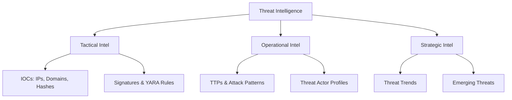

# Threat Intelligence Integration


> "Know your enemy and know yourself, and you need not fear the result of a hundred battles" — Sun Tzu

## Introduction

This guide demonstrates how to integrate external threat intelligence (TI) feeds with GhostKit to enhance red team operations with the latest adversary tactics, techniques, and procedures (TTPs). By leveraging real-world threat data, security professionals can simulate sophisticated attacks with increased realism and effectiveness.

## Core Concepts

### Threat Intelligence Types

GhostKit supports integration with multiple forms of threat intelligence:



### Intelligence-Driven Operations

The GhostKit TI workflow enables:

1. **TTP Emulation** - Mimicking specific threat actor behaviors
2. **IOC Generation** - Creating realistic indicators of compromise
3. **Campaign Simulation** - Replicating end-to-end attack campaigns
4. **Defensive Validation** - Testing detection capabilities against known threats

## Supported Intelligence Sources

| Source Type | Examples | Data Format | GhostKit Integration |
|-------------|----------|-------------|----------------------|
| Open Source Feeds | MITRE ATT&CK, AlienVault OTX, PhishTank | STIX/TAXII, CSV, JSON | Direct API integration |
| Commercial Feeds | Recorded Future, CrowdStrike Intelligence | Proprietary APIs | API client modules |
| ISAC/ISAO Feeds | FS-ISAC, H-ISAC | STIX/TAXII | TAXII client |
| Custom Intelligence | Internal IOCs, Threat Reports | CSV, JSON, YARA | File import |
| Malware Intelligence | MalwareBazaar, VirusTotal | JSON, Binary | Sample analysis |

## Basic Usage

### Configuring Intelligence Sources

Create a threat intelligence configuration file:

```yaml
# ti_config.yaml
sources:
  - name: mitre-attack
    type: attack-patterns
    url: https://raw.githubusercontent.com/mitre/cti/master/enterprise-attack/enterprise-attack.json
    format: stix
    refresh_interval: 86400  # daily
    
  - name: alienvault-otx
    type: ioc-feed
    url: https://otx.alienvault.com/api/v1/indicators/export
    format: json
    api_key: "${OTX_API_KEY}"
    refresh_interval: 3600  # hourly
    
  - name: phishtank
    type: url-feed
    url: http://data.phishtank.com/data/${PHISHTANK_API_KEY}/online-valid.json
    format: json
    refresh_interval: 43200  # twice daily

  - name: custom-iocs
    type: custom
    path: /path/to/custom_iocs.csv
    format: csv
    mapping:
      - column: indicator
        field: ioc
      - column: type
        field: ioc_type
      - column: confidence
        field: confidence_score
```

Load the configuration:

```bash
# Initialize the threat intelligence engine
python ghostkit.py -m ti_engine --config ti_config.yaml --initialize

# Update all intelligence sources
python ghostkit.py -m ti_engine --update-all
```

### Basic Intelligence Queries

```bash
# Search for IOCs
python ghostkit.py -m ti_engine --search-ioc 192.168.1.100
python ghostkit.py -m ti_engine --search-ioc evil-domain.com
python ghostkit.py -m ti_engine --search-ioc 5f4dcc3b5aa765d61d8327deb882cf99

# Search for TTPs
python ghostkit.py -m ti_engine --search-technique T1566 # Phishing
python ghostkit.py -m ti_engine --search-tactic TA0001 # Initial Access
```

## Advanced Integration

### Threat Actor Emulation

```bash
# List available threat actor profiles
python ghostkit.py -m ti_engine --list-actors

# Load specific threat actor TTPs
python ghostkit.py -m ti_engine --load-actor APT29

# Generate campaign plan based on actor profile
python ghostkit.py -m campaign_planner --actor APT29 --target-sector finance
```

Example output:
```
[+] GhostKit v3.1.4 initializing...
[+] Loading ti_engine module
[+] Loading APT29 threat actor profile
[+] Actor: APT29 (Cozy Bear)
[+] Associated nation-state: Russian Federation
[+] Target sectors: Government, Think Tanks, Healthcare, Finance
[+] Notable techniques:
    [*] T1566.001 - Spear-phishing Attachments
    [*] T1053.005 - Scheduled Task
    [*] T1027 - Obfuscated Files or Information
    [*] T1140 - Deobfuscate/Decode Files or Information
    [*] T1573.002 - Encrypted Channel: Asymmetric Cryptography
[+] Generating campaign plan for finance sector...
[+] Campaign plan generated:
    [*] Phase 1: Initial Access - Spear-phishing with malicious attachment
    [*] Phase 2: Execution - Malicious document with macro
    [*] Phase 3: Persistence - Scheduled tasks and registry modifications
    [*] Phase 4: Command & Control - HTTPS with custom encryption
    [*] Phase 5: Exfiltration - Encrypted file transfer via HTTPS
[+] Campaign plan saved to: campaigns/APT29_finance_campaign.json
```

### TTP-Based Module Selection

```bash
# Generate module chain based on MITRE techniques
python ghostkit.py -m ti_engine --techniques T1566.001,T1204.002,T1547.001,T1070.004,T1567.002 --generate-module-chain
```

Example output:
```
[+] GhostKit v3.1.4 initializing...
[+] Loading ti_engine module
[+] Analyzing techniques:
    [*] T1566.001 - Spear-phishing Attachments
    [*] T1204.002 - User Execution: Malicious File
    [*] T1547.001 - Boot or Logon Autostart Execution: Registry Run Keys / Startup Folder
    [*] T1070.004 - Indicator Removal on Host: File Deletion
    [*] T1567.002 - Exfiltration Over Web Service: Exfiltration to Cloud Storage
[+] Recommended module chain:
    [1] phishing_toolkit --template financial_report --attachment-type doc
    [2] macro_generator --payload downloader --obfuscation-level high
    [3] persistence_manager --technique registry --location HKCU\\Software\\Microsoft\\Windows\\CurrentVersion\\Run
    [4] file_manager --secure-delete --target operation_logs
    [5] cloud_exfiltrator --service dropbox --encryption enabled
[+] Command sequence saved to: operations/ttp_based_operation.json
```

### IOC Generation for Testing

```bash
# Generate realistic IOCs based on threat actor profile
python ghostkit.py -m ioc_generator --actor APT29 --count 10 --types ip,domain,hash,filename
```

Example output:
```
[+] GhostKit v3.1.4 initializing...
[+] Loading ioc_generator module
[+] Generating IOCs based on APT29 profile
[+] Generated IOCs:
    [*] IP: 185.86.148.227
    [*] IP: 103.208.86.9
    [*] Domain: update-service.net
    [*] Domain: microsoft-cdn-storage.com
    [*] Hash (MD5): 8f154d23ac2071d7f179959aaba37ad5
    [*] Hash (SHA256): 5a2f...a4c2 (truncated)
    [*] Filename: svchost_update.exe
    [*] Filename: winupdate_KB4023307.exe
    [*] Filename: document_scan.pdf
    [*] Filename: quarterly_finance_report.xlsm
[+] IOCs saved to: iocs/APT29_generated_iocs.json
```

## Intelligence-Driven Operations

### Campaign Execution Framework

The Campaign Execution Framework allows for full threat actor emulation:

```bash
# Create and execute a full APT campaign
python ghostkit.py -m campaign_executor --plan campaigns/APT29_finance_campaign.json --target-range 192.168.1.0/24
```

Execution phases:

1. **Intelligence Gathering** - Passive reconnaissance based on actor TTPs
2. **Initial Access** - Actor-specific access vectors
3. **Execution & Persistence** - Installing tools and backdoors matching actor behavior
4. **Lateral Movement** - Using actor-specific techniques
5. **Data Collection & Exfiltration** - Targeting data types relevant to the actor

### Detection Validation

Test defensive controls against known threat behaviors:

```bash
# Test detection capabilities against APT29 techniques
python ghostkit.py -m detection_validator --actor APT29 --techniques T1566.001,T1053.005 --target 192.168.1.100
```

## STIX/TAXII Integration

### Consuming TAXII Feeds

```bash
# Configure TAXII server connection
python ghostkit.py -m taxii_client --add-server --name example-taxii --url https://cti-taxii.example.org/taxii --collection threat-intel --username user --password pass

# List available collections
python ghostkit.py -m taxii_client --server example-taxii --list-collections

# Import data from collection
python ghostkit.py -m taxii_client --server example-taxii --collection threat-intel --import-data
```

### Working with STIX Objects

```python
# GhostKit Python module example for STIX object handling
from ghostkit.modules.ti import StixHandler

# Create a STIX handler
stix = StixHandler()

# Load STIX bundle
stix.load_bundle('path/to/stix_bundle.json')

# Extract techniques from STIX data
techniques = stix.extract_techniques()
for technique in techniques:
    print(f"Technique: {technique['id']} - {technique['name']}")
    print(f"Description: {technique['description']}")
    
# Extract relationships
relationships = stix.extract_relationships('intrusion-set', 'attack-pattern')
for rel in relationships:
    print(f"Actor {rel['source_name']} uses technique {rel['target_name']}")
```

## Threat Hunting Integration

Use threat intelligence to guide hunting operations:

```bash
# Generate hunting queries from threat intelligence
python ghostkit.py -m ti_engine --actor APT29 --generate-hunt-queries --formats sigma,splunk,elastic

# Execute hunt based on intelligence
python ghostkit.py -m threat_hunter --ioc-file iocs/APT29_generated_iocs.json --target-range 192.168.1.0/24
```

Example hunting query generation:
```
[+] GhostKit v3.1.4 initializing...
[+] Loading ti_engine module
[+] Generating hunt queries for APT29
[+] Sigma query for PowerShell obfuscation technique:
    title: APT29 PowerShell Obfuscation Pattern
    id: 5f23c11-e558-4e52-bfee-c9a232f429a5
    status: experimental
    description: Detects PowerShell obfuscation techniques used by APT29
    references:
      - https://attack.mitre.org/groups/G0016/
    author: GhostKit TI Engine
    date: 2025/05/30
    tags:
      - attack.execution
      - attack.t1059.001
    logsource:
      product: windows
      service: powershell
    detection:
      selection:
        EventID:
          - 4103
          - 4104
        ScriptBlockText|contains|all:
          - 'Join'
          - 'char'
          - '101,120,101,99'
      condition: selection
    falsepositives:
      - Legitimate PowerShell scripts using char arrays
    level: high
[+] Splunk query for scheduled task persistence:
    index=windows EventCode=4698 OR (source="WinEventLog:Microsoft-Windows-TaskScheduler/Operational" EventCode=106) 
    | regex TaskName=".*(update|service|microsoft|windows).*" 
    | regex Command=".*(powershell|cmd|wscript|rundll32).*"
[+] Queries saved to: hunting/APT29_hunt_queries.json
```

## Custom Intelligence Management

### Creating Custom Intelligence

```bash
# Create a custom threat actor profile
python ghostkit.py -m ti_engine --create-actor --name CUSTOM_ACTOR --nation-state "Example Country" --target-sectors finance,healthcare

# Add techniques to custom actor
python ghostkit.py -m ti_engine --actor CUSTOM_ACTOR --add-techniques T1566.001,T1204.002,T1547.001

# Add IOCs to custom actor
python ghostkit.py -m ti_engine --actor CUSTOM_ACTOR --add-iocs iocs/custom_iocs.csv

# Export custom actor profile
python ghostkit.py -m ti_engine --actor CUSTOM_ACTOR --export custom_actor.json
```

### Intelligence Sharing

```bash
# Export intelligence in STIX format
python ghostkit.py -m ti_engine --export-stix --output intel.json

# Share via TAXII server (if authorized)
python ghostkit.py -m taxii_publisher --server internal-taxii --collection internal-threats --file intel.json
```

## Intelligence-Driven Reporting

Generate reports based on threat intelligence:

```bash
# Generate threat intelligence report
python ghostkit.py -m ti_reporter --actor APT29 --timeframe "last 90 days" --output-format pdf --template executive
```

Example report sections:
- Executive Summary
- Threat Actor Profile
- Recent Campaign Analysis
- Observed TTPs
- Recommended Detections
- IOCs for Hunting

## Advanced Use Cases

### Threat Assessment

```bash
# Assess environment against known threats
python ghostkit.py -m threat_assessment --network 192.168.1.0/24 --compare-to APT29,APT28
```

Example output:
```
[+] GhostKit v3.1.4 initializing...
[+] Loading threat_assessment module
[+] Scanning network 192.168.1.0/24
[+] Comparing environment to APT29 profile
[+] Potential vulnerabilities that align with APT29 TTPs:
    [*] HIGH: Exchange server vulnerable to ProxyLogon (CVE-2021-26855)
        - Aligns with APT29's use of web exploitation for initial access
    [*] MEDIUM: PowerShell execution policy set to unrestricted on 7 systems
        - Aligns with APT29's use of PowerShell for execution
    [*] MEDIUM: Outdated Windows systems missing security patches
        - Aligns with APT29's use of privilege escalation exploits
[+] Assessment report saved to: assessments/APT29_threat_assessment.pdf
```

### Threat Prediction

```bash
# Predict potential attack paths based on intelligence
python ghostkit.py -m attack_predictor --initial-access exchange --threat-actors APT29,APT40
```

Example prediction:
```
[+] GhostKit v3.1.4 initializing...
[+] Loading attack_predictor module
[+] Analyzing potential attack paths from Exchange Server compromise
[+] Based on APT29 and APT40 TTPs, predicted attack path:
    [1] Initial Access: Exchange Server exploitation (probability: HIGH)
    [2] Execution: PowerShell or WMI (probability: HIGH)
    [3] Persistence: Scheduled Tasks or Registry Run Keys (probability: HIGH) 
    [4] Privilege Escalation: Token manipulation (probability: MEDIUM)
    [5] Lateral Movement: Pass-the-Hash or RDP (probability: HIGH)
    [6] Data Collection: File system scans for sensitive data (probability: HIGH)
    [7] Exfiltration: Encrypted HTTPS or DNS tunneling (probability: MEDIUM)
[+] Attack path visualization saved to: predictions/exchange_attack_path.pdf
```

## API Integrations

### VirusTotal Integration

```bash
# Check IOCs against VirusTotal
python ghostkit.py -m vt_checker --api-key "$VT_API_KEY" --iocs iocs/suspicious_indicators.txt

# Enrich threat actor profile with VirusTotal data
python ghostkit.py -m ti_engine --actor APT29 --enrich-with virustotal
```

### MISP Integration

```bash
# Connect to MISP instance
python ghostkit.py -m misp_connector --url https://misp.example.org --api-key "$MISP_API_KEY" --verify-ssl

# Import events from MISP
python ghostkit.py -m misp_connector --import-events --tags APT29,financial --last-days 30

# Export findings to MISP
python ghostkit.py -m misp_connector --create-event --info "GhostKit Red Team Findings" --distribution 0 --threat-level 2 --analysis 2 --file findings.json
```

## Best Practices

1. **Maintain Intelligence Currency**
   ```bash
   # Set up automatic intelligence updates
   python ghostkit.py -m ti_engine --schedule-updates --interval daily --time "04:00"
   ```

2. **Attribution Confidence Levels**
   ```bash
   # Set confidence thresholds for attribution
   python ghostkit.py -m ti_engine --confidence-thresholds --low 30 --medium 60 --high 85
   ```

3. **Ethical Use of Intelligence**
   - Always operate within authorized scope
   - Focus on defensive improvements
   - Respect data privacy when handling intelligence
   - Adhere to responsible disclosure practices

4. **Intelligence Lifecycle Management**
   ```bash
   # Implement intelligence expiration
   python ghostkit.py -m ti_engine --set-expiration --ioc-types ip,domain --days 90
   ```

## Troubleshooting

| Issue | Possible Cause | Solution |
|-------|----------------|----------|
| API connection failures | Rate limiting, invalid credentials | Implement backoff strategy, verify API keys |
| Stale intelligence | Outdated feeds | Check update schedules, manually refresh critical feeds |
| False positives | Low-confidence indicators | Adjust confidence thresholds, validate indicators |
| Missing context | Incomplete intelligence | Enrich indicators with additional sources |

## References

- [MITRE ATT&CK](https://attack.mitre.org/)
- [STIX 2.1 Specification](https://docs.oasis-open.org/cti/stix/v2.1/stix-v2.1.html)
- [TAXII 2.1 Specification](https://docs.oasis-open.org/cti/taxii/v2.1/taxii-v2.1.html)
- [OpenCTI Documentation](https://www.opencti.io/docs/)
- [VirusTotal API Documentation](https://developers.virustotal.com/reference)
- [MISP Documentation](https://www.misp-project.org/documentation/)

---

*Last updated: May 30, 2025*
