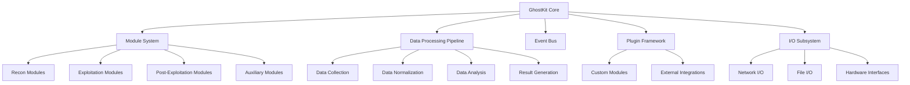
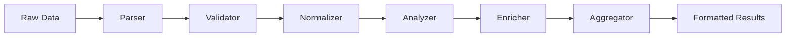
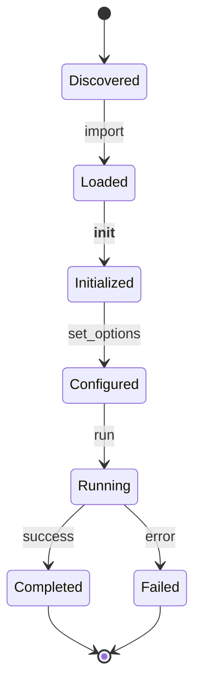
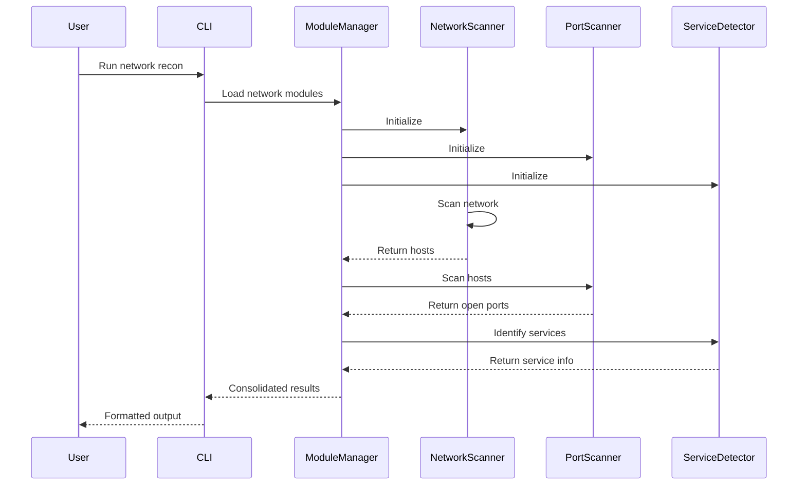

# GhostKit Architecture


> "Complexity made simple through elegant design" — GhostKit Architecture Philosophy

## System Architecture Overview

GhostKit employs a sophisticated modular architecture designed for maximum flexibility, extensibility, and operational effectiveness. This document provides a technical deep-dive into the framework's internal components and data flows.



## Core Subsystems

### 1. Kernel (modules/base_module.py)

The kernel is the central nervous system of GhostKit, providing core functionality:

- Module loading and initialization
- Command parsing and routing
- Configuration management
- Logging and telemetry
- Error handling and recovery

```python
class BaseModule(abc.ABC):
    """Base class that all GhostKit modules must inherit from"""

    def __init__(self) -> None:
        name_value = getattr(self, "name", self.__class__.__name__)
        description_value = getattr(self, "description", "Base module interface")

        self.name: str = name_value
        self.description: str = description_value
        self.logger: logging.Logger = logging.getLogger(f"GhostKit.{self.name}")
        self.args_parser: argparse.ArgumentParser = self._create_arg_parser()
        self.config_file: Optional[Path] = None
        
        # Wrapping the run method for standardized result handling
        original_run = self.run
        
        # Implementation details...
```

### 2. Module System (modules/module_manager.py)

The Module System handles dynamic loading, execution, and management of functional modules:

- Runtime module discovery
- Dependency resolution
- Module lifecycle management
- Inter-module communication

**Module Categories:**

| Category | Purpose | Key Features |
|----------|---------|--------------|
| Reconnaissance | Information gathering | Network mapping, asset discovery, OSINT |
| Vulnerability Assessment | Finding weaknesses | Vulnerability scanning, configuration analysis |
| Exploitation | Leveraging vulnerabilities | Exploit delivery, payload generation |
| Post-Exploitation | Actions after access | Persistence, privilege escalation, lateral movement |
| Reporting | Documentation | Evidence collection, report generation |

### 3. Data Processing Pipeline (core/data_pipeline.py)

GhostKit's data pipeline transforms raw inputs into actionable intelligence:

1. **Collection Layer** - Gathering raw data from targets
2. **Parsing Layer** - Converting raw data into structured formats
3. **Analysis Layer** - Identifying patterns, vulnerabilities, and attack vectors
4. **Presentation Layer** - Formatting results for consumption



### 4. Event Bus (core/event_bus.py)

The Event Bus provides a publish-subscribe mechanism for loose coupling between components:

- Asynchronous event processing
- Event filtering and routing
- Prioritization of critical events
- Observer pattern implementation

```python
class EventBus:
    def __init__(self):
        self._subscribers = defaultdict(list)
        self._global_subscribers = []
        self._lock = threading.RLock()
        
    def subscribe(self, event_type=None, callback=None):
        """Subscribe to a specific event type or all events"""
        with self._lock:
            if event_type is None:
                self._global_subscribers.append(callback)
            else:
                self._subscribers[event_type].append(callback)
                
    def publish(self, event):
        """Publish an event to all subscribers"""
        with self._lock:
            # Implementation details...
```

### 5. I/O Subsystem (io/*)

The I/O Subsystem handles all external interactions:

- Network communication
- File operations
- Hardware interfaces
- User interface (CLI/GUI)

## Key Architectural Patterns

### 1. Plugin Architecture

GhostKit's plugin system allows for unlimited extensibility:

```python
@dataclass
class PluginMetadata:
    name: str
    version: str
    author: str
    description: str
    entry_point: str
    dependencies: List[str]

class PluginManager:
    def __init__(self, plugin_dir: Path):
        self.plugin_dir = plugin_dir
        self.plugins: Dict[str, Plugin] = {}
        self._load_plugins()
        
    def _load_plugins(self):
        """Discover and load all plugins from the plugin directory"""
        # Implementation details...
```

### 2. Command Pattern

Commands are first-class objects in GhostKit:

```python
class Command:
    def __init__(self, name, description, callback, parameters=None):
        self.name = name
        self.description = description
        self.callback = callback
        self.parameters = parameters or []
        
    def execute(self, *args, **kwargs):
        """Execute the command with the given arguments"""
        return self.callback(*args, **kwargs)
```

### 3. Observer Pattern

The Observer pattern allows components to react to system events:

```python
class Observable:
    def __init__(self):
        self._observers = []
        
    def add_observer(self, observer):
        if observer not in self._observers:
            self._observers.append(observer)
            
    def remove_observer(self, observer):
        self._observers.remove(observer)
        
    def notify_observers(self, *args, **kwargs):
        for observer in self._observers:
            observer.update(self, *args, **kwargs)
```

### 4. Factory Pattern

Module creation is handled by factories:

```python
class ModuleFactory:
    @staticmethod
    def create_module(module_type, config=None):
        """Create a module of the specified type with the given configuration"""
        module_map = {
            "network_scanner": NetworkScannerModule,
            "web_scanner": WebScannerModule,
            # Other module types...
        }
        
        if module_type not in module_map:
            raise ValueError(f"Unknown module type: {module_type}")
            
        module_class = module_map[module_type]
        return module_class(config)
```

## Module Deep-Dive

### Module Lifecycle



### Module Interfaces

All modules implement standard interfaces to ensure consistency:

```python
class Module(abc.ABC):
    @abc.abstractmethod
    def _create_arg_parser(self) -> argparse.ArgumentParser:
        """Create the argument parser for this module"""
        pass
        
    @abc.abstractmethod
    def run(self, args: List[str]) -> ModuleResult:
        """Run the module with the given arguments"""
        pass
        
    def validate_args(self, args: List[str]) -> bool:
        """Validate the arguments for this module"""
        try:
            self.args_parser.parse_args(args)
            return True
        except Exception:
            return False
```

## Data Flow

### Command Execution Flow

1. User input → Command parsing
2. Command validation → Module selection
3. Module initialization → Argument processing
4. Execution → Real-time feedback
5. Result collection → Output formatting
6. Reporting → Data persistence

### Inter-Module Communication



## Security Features

GhostKit implements several security measures to protect both the operator and target systems:

### 1. Input Validation

All user inputs and external data undergo strict validation:

```python
def validate_target(target: str) -> bool:
    """Validate target format (IP, domain, URL)"""
    ip_pattern = r"^(?:[0-9]{1,3}\.){3}[0-9]{1,3}(?:/[0-9]{1,2})?$"
    domain_pattern = r"^(?:[a-zA-Z0-9](../index.md)?\.)+[a-zA-Z]{2,}$"
    url_pattern = r"^https?://(?:[-\w.]|(?:%[\da-fA-F]{2}))+(?::\d+)?(?:/[-\w%!$&'()*+,;=:@/~]+)*$"
    
    return (re.match(ip_pattern, target) is not None or
            re.match(domain_pattern, target) is not None or
            re.match(url_pattern, target) is not None)
```

### 2. Sanitization

Output sanitization prevents command injection and other attacks:

```python
def sanitize_output(output: str) -> str:
    """Sanitize output to prevent terminal escape sequence injection"""
    # Remove ANSI escape sequences
    ansi_escape = re.compile(r'\x1B(?:[@-Z\\-_]|\[[0-?]*[ -/]*[@-~])')
    sanitized = ansi_escape.sub('', output)
    
    # Remove other potentially dangerous characters
    sanitized = re.sub(r'[^\x20-\x7E\r\n\t]', '', sanitized)
    
    return sanitized
```

### 3. Rate Limiting

Built-in rate limiting prevents accidental DoS conditions:

```python
class RateLimiter:
    def __init__(self, max_calls: int, period: float):
        self.max_calls = max_calls
        self.period = period
        self.calls = []
        self._lock = threading.RLock()
        
    def __call__(self, func):
        @functools.wraps(func)
        def wrapper(*args, **kwargs):
            with self._lock:
                now = time.time()
                # Remove calls older than the period
                self.calls = [t for t in self.calls if now - t < self.period]
                
                if len(self.calls) >= self.max_calls:
                    raise RateLimitExceeded(
                        f"Rate limit exceeded: {self.max_calls} calls per {self.period}s"
                    )
                
                self.calls.append(now)
                
            return func(*args, **kwargs)
        
        return wrapper
```

## Performance Optimization

GhostKit employs several techniques to maximize performance:

1. **Asynchronous I/O** - Non-blocking operations for network and file I/O
2. **Thread Pooling** - Resource-efficient concurrency
3. **Lazy Loading** - Modules loaded only when needed
4. **Result Caching** - Prevent duplicate work
5. **Resource Management** - Careful allocation and deallocation of system resources

## Extension Points

GhostKit can be extended through several mechanisms:

1. **Custom Modules** - Develop specialized functionality
2. **Plugins** - Add third-party integrations
3. **API Hooks** - Intercept and modify core behavior
4. **Custom Protocols** - Implement new communication methods
5. **Output Formatters** - Create custom reporting formats

## Future Architecture

The GhostKit roadmap includes several architectural improvements:

1. **Distributed Operation** - Coordinated multi-agent deployments
2. **Machine Learning Integration** - Intelligent targeting and exploitation
3. **Advanced Evasion** - Polymorphic payloads and behavior-based evasion
4. **Supply Chain Analysis** - Identifying vulnerabilities in software supply chains
5. **Zero-Trust Integration** - Testing zero-trust architectures

## References

- [Module System Documentation](../modules/exploit_engine.md)
- [Data Flow Documentation](../index.md)
- [Plugin Development Guide](../development/plugin-development.md)
- [API Reference](../development/api-reference.md)

---

*Last updated: May 30, 2025*
