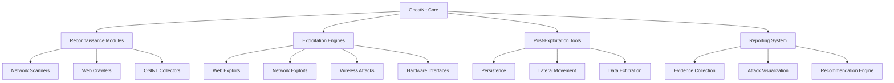

# GhostKit Overview

> "Knowledge is power. GhostKit is unlimited power." — Anonymous Security Researcher

## What is GhostKit?

GhostKit is a next-generation offensive security framework built for sophisticated red team operations, penetration testing, and vulnerability research. Combining advanced reconnaissance capabilities with powerful exploitation engines, GhostKit offers a comprehensive toolkit for security professionals.

### 🔥 Core Features

- **Modular Architecture** - Extensible plugin system allows rapid integration of new attack vectors
- **Multi-Vector Approach** - Seamlessly pivot between network, web, wireless, and hardware exploitation
- **Smart Automation** - AI-powered vulnerability analysis to prioritize attack paths
- **Stealth Operations** - Advanced evasion techniques to bypass detection systems
- **Comprehensive Reporting** - Detailed findings with remediation recommendations
- **MITRE ATT&CK Integration** - Map all activities to the industry-standard security framework

## Ethical Usage

GhostKit is designed for authorized security testing only. Users must:

- Obtain proper authorization before testing any systems
- Comply with local and international laws
- Follow responsible disclosure practices
- Never use these tools against unauthorized targets

## GhostKit Ecosystem

## Target Environments

GhostKit operates effectively across diverse environments:

| Environment | Capability | Module Coverage |
| ----------- | ---------- | --------------- |
| Web Applications | High | 15+ attack vectors |
| Internal Networks | High | Full reconnaissance & exploitation |
| Wireless Networks | Medium | 802.11, Bluetooth, RFID |
| IoT Devices | Medium | Common protocols & interfaces |
| Mobile Applications | Basic | In development |
| Cloud Infrastructure | Basic | AWS, Azure basics |

## Getting Started

Ready to unleash the power of GhostKit? Continue to the [Installation Guide](../installation.md) to set up your environment, or jump straight to the [Quick Start Guide](quickstart.md) if you're feeling dangerous.

!!! danger "Production Warning"
    GhostKit contains powerful exploitation capabilities. Always use in controlled environments with proper authorization. The developers assume no liability for misuse.

## Community & Support

Join our thriving community of security professionals:

- [GitHub Discussions](https://github.com/K11E3R/GhostKit/discussions)
- [Discord Channel](https://discord.gg/ghostkit)
- [Weekly Office Hours](https://meet.ghostkit.io/office-hours)

---

*Last updated: May 30, 2025*
