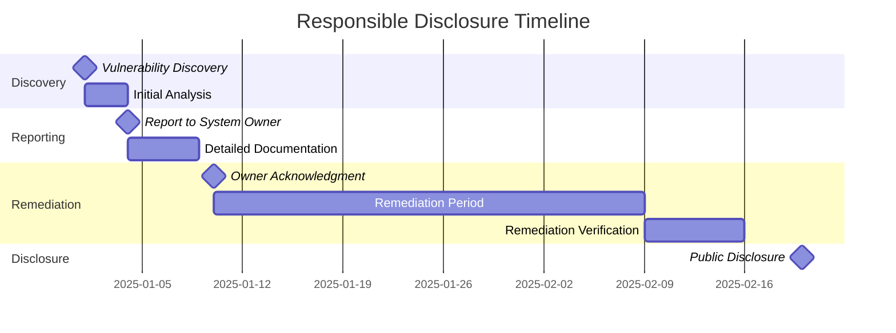

# Security Advisories & Legal Considerations


> "With great power comes great responsibility" — GhostKit Ethics Statement

## Introduction

GhostKit is a powerful security assessment toolkit designed for authorized security testing only. This document outlines critical legal, ethical, and security considerations for all users.

⚠️ **IMPORTANT NOTICE**: GhostKit must only be used on systems and networks for which you have explicit authorization to test. Unauthorized use may violate local, national, and international laws, potentially resulting in civil penalties and criminal prosecution.

## Legal Frameworks

Security testing activities are governed by various legal frameworks depending on your jurisdiction:

| Jurisdiction | Key Legislation | Relevant Provisions |
|--------------|----------------|---------------------|
| United States | Computer Fraud and Abuse Act (CFAA) | Prohibits unauthorized access to protected computers |
| European Union | Network and Information Security (NIS) Directive | Establishes security requirements for critical infrastructure |
| United Kingdom | Computer Misuse Act | Criminalizes unauthorized access to computer systems |
| Australia | Security of Critical Infrastructure Act | Protects critical infrastructure from cyber threats |
| International | Budapest Convention on Cybercrime | Harmonizes cybercrime laws across countries |

## Authorization Requirements

### Written Authorization

Before conducting any security testing with GhostKit, ensure you have:

1. **Explicit Written Authorization** - Formal permission from the system owner
2. **Clearly Defined Scope** - Specific systems, networks, and testing boundaries
3. **Testing Timeline** - Approved dates and times for testing activities
4. **Emergency Contacts** - Designated points of contact for incidents
5. **Rules of Engagement** - Specific allowed and prohibited testing activities

Example authorization letter template:

```
[ORGANIZATION LETTERHEAD]

Date: [DATE]

Re: Authorization for Security Testing

To Whom It May Concern:

This letter serves as formal authorization for [TESTER/COMPANY] to conduct security assessment activities on [ORGANIZATION]'s systems as specified below:

1. Scope of Authorization:
   • Target systems/networks: [SPECIFIC IP RANGES, DOMAINS, APPLICATIONS]
   • Excluded systems: [SPECIFIC EXCLUSIONS]

2. Testing Period:
   • Start date/time: [START DATE/TIME]
   • End date/time: [END DATE/TIME]

3. Authorized Testing Activities:
   • [LIST SPECIFIC PERMITTED ACTIVITIES]

4. Prohibited Activities:
   • [LIST SPECIFIC PROHIBITED ACTIVITIES]

5. Emergency Contacts:
   • Primary: [NAME, PHONE, EMAIL]
   • Secondary: [NAME, PHONE, EMAIL]

This authorization is valid only for the specified scope, timeline, and activities. Any testing outside these parameters is unauthorized.

Sincerely,

[SIGNATURE]
[NAME]
[TITLE]
[CONTACT INFORMATION]
```

### Multi-Party Authorization

For environments with multiple stakeholders (e.g., cloud-hosted applications), ensure authorization from all relevant parties:

- Application owner
- Infrastructure provider
- Data custodian
- Third-party service providers

## Prohibited Activities

Even with authorization, the following activities are prohibited:

1. **Destructive Testing** - Actions that corrupt data or disrupt services
2. **Exfiltrating Sensitive Data** - Transferring PII, PHI, financial data, or intellectual property
3. **Exceeding Scope** - Testing systems outside the authorized boundaries
4. **Credential Sharing** - Using testing credentials for unauthorized purposes
5. **Maintaining Unauthorized Access** - Keeping access beyond the testing period

## Cloud Provider Policies

Major cloud providers have specific policies regarding penetration testing:

### Amazon Web Services (AWS)

- [AWS Penetration Testing Policy](https://aws.amazon.com/security/penetration-testing/)
- No permission required for:
  - EC2 instances, NAT Gateways, ELBs
  - RDS, CloudFront, Aurora, API Gateways
  - Lambda, Lightsail, Elastic Beanstalk
- Permission required for:
  - DDoS simulations
  - Route 53 Hosted Zones
  - DNS zone walking

### Microsoft Azure

- [Microsoft Azure Penetration Testing Rules of Engagement](https://www.microsoft.com/en-us/msrc/pentest-rules-of-engagement)
- Testing allowed without prior approval for your own subscriptions
- Prohibited tests:
  - DoS/DDoS attacks
  - Physical attacks
  - Social engineering
  - Testing of Microsoft accounts

### Google Cloud Platform (GCP)

- [Google Cloud Platform Penetration Testing](https://cloud.google.com/security/infrastructure/design)
- No prior permission required for most testing
- Prohibited tests:
  - DoS/DDoS attacks
  - Phishing campaigns against Google employees
  - Physical attacks

## Industry-Specific Considerations

### Healthcare (HIPAA)

When testing healthcare systems:

- Ensure Business Associate Agreement (BAA) is in place
- Avoid accessing Protected Health Information (PHI)
- Report any accidental PHI access immediately
- Verify all testing activities comply with the HIPAA Security Rule

### Financial Services

When testing financial systems:

- Comply with PCI DSS requirements for security testing
- Adhere to relevant financial regulations (e.g., GLBA, SOX)
- Avoid testing production payment processing systems
- Ensure testing doesn't trigger regulatory reporting requirements

### Critical Infrastructure

When testing critical infrastructure:

- Follow ICS-CERT guidelines for industrial control systems
- Implement enhanced safety protocols
- Consider regulatory requirements (e.g., NERC CIP for energy sector)
- Use staged testing approaches to minimize risk

## Ethical Considerations

### Responsible Disclosure

If vulnerabilities are discovered during authorized testing:

1. **Document Thoroughly** - Record detailed information about the vulnerability
2. **Report Promptly** - Inform the system owner according to agreed timelines
3. **Provide Remediation Guidance** - Suggest specific mitigation strategies
4. **Maintain Confidentiality** - Do not disclose vulnerabilities to unauthorized parties
5. **Allow Remediation Time** - Provide reasonable time for fixes before wider disclosure

Example vulnerability disclosure timeline:



### Vulnerability Handling

Proper vulnerability handling includes:

1. **Classification** - Categorize by severity (e.g., CVSS scoring)
2. **Verification** - Confirm the vulnerability is real and exploitable
3. **Documentation** - Record detailed technical information
4. **Reporting** - Use secure channels for vulnerability communication
5. **Tracking** - Maintain a record of discovered vulnerabilities and their status

## Data Protection Requirements

### Handling Sensitive Data

When encountering sensitive data during testing:

1. **Minimize Exposure** - Access only what is necessary
2. **Avoid Collection** - Do not collect or store sensitive data
3. **Secure Reporting** - Redact sensitive information in reports
4. **Secure Communication** - Use encrypted channels for all communications
5. **Data Destruction** - Securely delete any test data after testing

### Privacy Regulations

Consider the impact of privacy regulations:

| Regulation | Jurisdiction | Key Requirements |
|------------|--------------|------------------|
| GDPR | European Union | Data minimization, security measures, breach notification |
| CCPA/CPRA | California, US | Consumer rights, data security, service provider requirements |
| PIPEDA | Canada | Consent, purpose limitation, safeguards |
| LGPD | Brazil | Legal basis for processing, security measures |
| POPIA | South Africa | Security safeguards, processing limitation |

## Operational Security

### Evidence Collection

When collecting evidence during testing:

1. **Secure Storage** - Use encrypted storage for all evidence
2. **Chain of Custody** - Maintain documentation of who accessed evidence
3. **Minimization** - Collect only necessary information
4. **Sanitization** - Remove sensitive data from evidence
5. **Secure Transmission** - Use encrypted channels when transferring evidence

### Report Security

Security reports contain sensitive information:

1. **Classification** - Mark reports with appropriate classification levels
2. **Access Control** - Limit access to authorized individuals
3. **Secure Delivery** - Use encrypted channels for report delivery
4. **Secure Storage** - Store reports in secure, encrypted repositories
5. **Retention Policy** - Establish clear timeframes for report retention

## Incident Response

### Testing Incidents

If testing activities cause unintended impact:

1. **Immediate Notification** - Contact emergency stakeholders immediately
2. **Activity Cessation** - Stop all testing activities
3. **Documentation** - Record the incident details
4. **Cooperation** - Assist with recovery efforts
5. **Post-Incident Analysis** - Conduct a review to prevent future incidents

### Emergency Protocols

Establish emergency protocols before testing:

```
EMERGENCY PROTOCOL:

1. INCIDENT IDENTIFICATION
   - System disruption
   - Data breach
   - Unintended access

2. IMMEDIATE ACTIONS
   - Cease all testing activities
   - Contact emergency point of contact:
     PRIMARY: [NAME] at [PHONE]
     SECONDARY: [NAME] at [PHONE]
   - Document current state and actions taken

3. COMMUNICATION PROCEDURE
   - Initial notification: Phone call within 15 minutes
   - Follow-up: Email with details within 30 minutes
   - Status updates: Every 30 minutes until resolution

4. RECOVERY SUPPORT
   - Provide technical details as requested
   - Assist with recovery efforts if requested
   - Document recovery actions

5. POST-INCIDENT
   - Submit incident report within 24 hours
   - Participate in post-incident review
   - Implement lessons learned for future testing
```

## GhostKitSpecific Considerations

### Module Usage Guidelines

| Module Category | Legal Considerations | Authorization Requirements |
|-----------------|----------------------|----------------------------|
| Reconnaissance | Low risk, potential ToS violations | General authorization |
| Vulnerability Scanning | Medium risk, potential service disruption | Specific scope authorization |
| Exploitation | High risk, potential damage/disruption | Explicit exploitation authorization |
| Post-Exploitation | Very high risk, access to sensitive data | Detailed post-exploitation authorization |
| Social Engineering | Legal risks vary by jurisdiction | Specific social engineering authorization |

### Safe Usage Features

GhostKit includes several safety features:

1. **Scope Enforcement** - Restricts testing to authorized targets
2. **Simulation Mode** - Tests exploitation without actual execution
3. **Impact Analysis** - Evaluates potential impact before actions
4. **Audit Logging** - Records all activities for accountability
5. **Kill Switch** - Emergency termination of all operations

Enable these features with:

```bash
# Enable all safety features
python ghostkit.py --safety-mode strict --enforce-scope --audit-logging --impact-analysis

# Run in simulation mode
python ghostkit.py -m web_scanner --target example.com --simulation-only

# Configure audit logging
python ghostkit.py --configure-auditing --log-level detailed --log-encryption --tamper-proof
```

## Compliance Documentation

### Audit Readiness

Maintain documentation to demonstrate compliance:

1. **Authorization Records** - All testing authorizations
2. **Testing Logs** - Detailed activity logs
3. **Methodology Documentation** - Testing approach and procedures
4. **Tool Calibration** - Evidence of tool validation
5. **Remediation Tracking** - Vulnerability management records

### Attestation Requirements

Some industries require formal attestation of security testing:

```
SECURITY TESTING ATTESTATION

I, [TESTER NAME], certify that:

1. Security testing was conducted on [SYSTEMS] from [START DATE] to [END DATE].

2. Testing was performed with explicit written authorization from [AUTHORIZING PARTY].

3. Testing scope was limited to the authorized systems and activities.

4. Testing was conducted in accordance with [RELEVANT STANDARDS/FRAMEWORKS].

5. All discovered vulnerabilities were reported to [RESPONSIBLE PARTY] on [DATE].

6. Testing activities complied with all applicable laws and regulations.

7. All testing data has been handled according to agreed security requirements.

[SIGNATURE]
[DATE]
[CERTIFICATION/QUALIFICATION]
```

## Common Legal Pitfalls

### Unauthorized Access

**Risk**: Accessing systems without proper authorization  
**Prevention**: Obtain detailed written authorization  
**Example Case**: United States v. Aaron Swartz (CFAA prosecution)

### Exceeding Authorization

**Risk**: Testing beyond authorized scope or timeframe  
**Prevention**: Clear scope definition and boundary validation  
**Example Case**: United States v. Andrew Auernheimer (AT&T data case)

### Data Protection Violations

**Risk**: Improper handling of personal or sensitive data  
**Prevention**: Data minimization and security controls  
**Example Case**: Multiple GDPR fines for security testing companies

### Third-Party System Impact

**Risk**: Affecting systems not owned by authorizing party  
**Prevention**: Careful scope planning and impact analysis  
**Example Case**: Various civil lawsuits involving cloud-hosted applications

## International Considerations

### Cross-Border Testing

For testing across international boundaries:

1. **Legal Jurisdiction** - Identify applicable laws in all relevant countries
2. **Data Transfer** - Comply with cross-border data transfer requirements
3. **Local Representatives** - Engage local legal experts when necessary
4. **Export Controls** - Consider security tool export restrictions
5. **Notification Requirements** - Comply with any mandatory reporting

### Export Controls

Security tools may be subject to export controls:

- Wassenaar Arrangement restrictions on cybersecurity tools
- U.S. Export Administration Regulations (EAR)
- Country-specific technology export laws
- Dual-use technology regulations

## Resources and References

### Legal Resources

- [EFF Coders' Rights Project](https://www.eff.org/issues/coders)
- [SANS Legal Concerns in Penetration Testing](https://www.sans.org/reading-room/whitepapers/legal/legal-concerns-penetration-testing-1274)
- [Legal Aspects of Penetration Testing](https://cybersecurity.att.com/blogs/security-essentials/legal-aspects-of-penetration-testing)
- [HackerOne Vulnerability Disclosure Policy](https://www.hackerone.com/disclosure-guidelines)

### Standards and Frameworks

- [NIST SP 800-115: Technical Guide to Information Security Testing](https://csrc.nist.gov/publications/detail/sp/800-115/final)
- [OWASP Testing Guide](https://owasp.org/www-project-web-security-testing-guide/)
- [Penetration Testing Execution Standard (PTES)](http://www.pentest-standard.org/)
- [ISO/IEC 27002: Security techniques](https://www.iso.org/standard/54533.html)

## Maintaining Legal Compliance

### Regular Reviews

Schedule regular legal compliance reviews:

- Quarterly review of authorization documentation
- Annual review of testing methodologies against legal requirements
- Regular updates to security testing policies
- Monitoring of legal and regulatory changes

### Legal Support

Establish relationships with legal resources:

- Engage cybersecurity attorneys for complex testing
- Maintain templates approved by legal counsel
- Develop escalation procedures for legal questions
- Consider cyber insurance for testing activities

## Conclusion

Security testing with GhostKit requires careful attention to legal and ethical considerations. By following the guidelines in this document, you can conduct effective security assessments while minimizing legal risks.

Remember that this document is not legal advice. Consult with qualified legal professionals for guidance specific to your situation and jurisdiction.

---

*Last updated: May 30, 2025*
