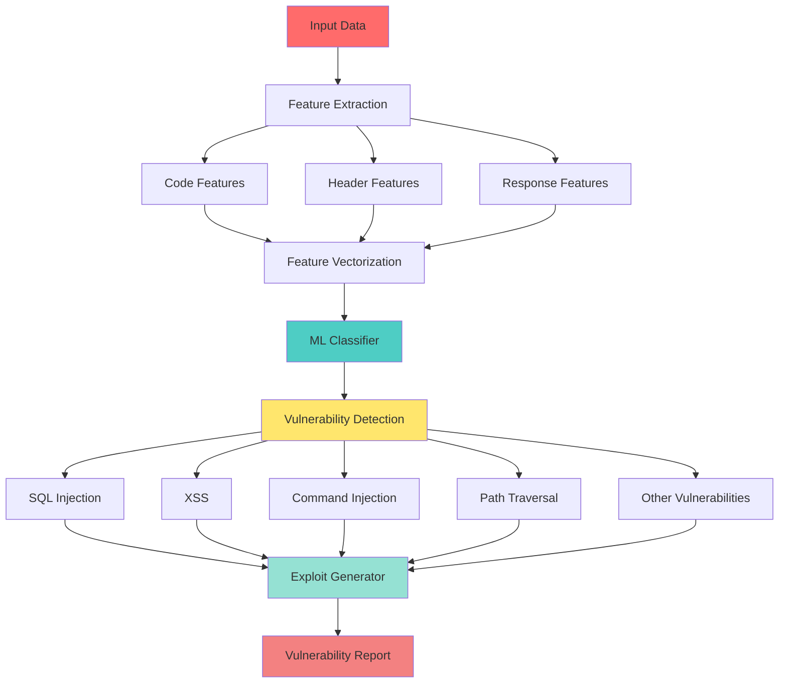

# AI Vulnerability Analyzer Module


> "Machine learning meets vulnerability assessment - intelligence-driven security analysis" — GhostKit Red Team

## Module Overview

The AI Vulnerability Analyzer leverages advanced machine learning techniques to automatically discover, classify, and suggest exploitation strategies for security vulnerabilities. By combining pattern recognition, feature extraction, and intelligent classification, this module provides automated vulnerability assessment that learns and improves over time.

### Core Capabilities

- **Automated Vulnerability Detection** - ML-powered identification of security flaws
- **Multi-Source Analysis** - Analyze code, HTTP headers, and response data
- **Intelligent Classification** - Categorize vulnerabilities by type and severity
- **Exploit Generation** - Automatic creation of exploitation strategies
- **Continuous Learning** - Improve detection through model training
- **Risk Assessment** - CVSS-based severity scoring

## Technical Architecture

The AI Vulnerability Analyzer uses a sophisticated ML pipeline:



## Vulnerability Coverage

| Vulnerability Type | Detection Method | Confidence Level |
|--------------------|------------------|------------------|
| **SQL Injection** | Pattern matching + ML classification | High (85-95%) |
| **Cross-Site Scripting (XSS)** | Context-aware analysis | High (80-90%) |
| **Command Injection** | Dangerous function detection | High (85-95%) |
| **File Inclusion** | Path analysis + pattern recognition | Medium (70-85%) |
| **Path Traversal** | Directory traversal pattern detection | High (80-90%) |
| **Insecure Deserialization** | Library fingerprinting | Medium (65-80%) |
| **XXE (XML External Entity)** | DTD pattern analysis | Medium (70-85%) |
| **Broken Authentication** | Session & auth pattern analysis | Medium (60-75%) |

## Basic Usage

### Command Line Interface

```bash
# Analyze source code file
python ghostkit.py -m ai_vulnerability_analyzer --target /path/to/code.php --mode scan

# Analyze HTTP response
python ghostkit.py -m ai_vulnerability_analyzer --target example.com --response response.txt --mode scan

# Full analysis with code and headers
python ghostkit.py -m ai_vulnerability_analyzer --target webapp --code source.php --headers headers.json --response response.txt

# Generate exploit suggestions
python ghostkit.py -m ai_vulnerability_analyzer --target code.php --mode exploit -o report.json

# Use custom ML model
python ghostkit.py -m ai_vulnerability_analyzer --target app.php --model custom_model.pkl --mode analyze
```

### Python API Usage

```python
from modules.ai_vulnerability_analyzer import VulnerabilityClassifier, ExploitGenerator

# Initialize classifier
classifier = VulnerabilityClassifier()

# Analyze source code
with open('vulnerable_code.php', 'r') as f:
    code = f.read()

predictions = classifier.predict(code=code)

# Review findings
for vuln_type, result in predictions.items():
    if result['detected']:
        print(f"Found {vuln_type}: {result['confidence']:.2%} confidence")
        print(f"Severity: {result['severity']}")

# Generate exploit suggestions
exploit_gen = ExploitGenerator()
exploits = exploit_gen.generate_exploits('sql_injection')

for exploit in exploits:
    print(f"Exploit: {exploit['name']}")
    print(f"Payload: {exploit['template']}")
```

## Operation Modes

### 1. Scan Mode

Basic vulnerability scanning with detection only.

```bash
python ghostkit.py -m ai_vulnerability_analyzer --target webapp.php --mode scan -o scan_results.json
```

**Output:**
```
[*] Running AI vulnerability analyzer against webapp.php
[!] Detected sql_injection with 0.87 confidence (Severity: high)
[!] Detected xss with 0.73 confidence (Severity: medium)
[*] No vulnerabilities detected for command_injection
[*] Scan complete: 2 vulnerabilities detected
    High: 1, Medium: 1, Low: 0
[*] Report saved to scan_results.json
```

### 2. Analyze Mode

In-depth analysis with detailed feature breakdown.

```bash
python ghostkit.py -m ai_vulnerability_analyzer --target app --code app.php --headers headers.json --mode analyze
```

**Output includes:**
- Feature extraction details
- Pattern matches
- Confidence scores with reasoning
- Security header analysis
- Input validation assessment

### 3. Exploit Mode

Generate exploitation suggestions for detected vulnerabilities.

```bash
python ghostkit.py -m ai_vulnerability_analyzer --target vulnerable.php --mode exploit -o exploits.json
```

**Output:**
```
[*] Running AI vulnerability analyzer against vulnerable.php
[!] Detected sql_injection with 0.92 confidence (Severity: high)
    Possible exploits:
    1. Basic Authentication Bypass: ' OR 1=1 --
    2. UNION Attack: ' UNION SELECT 1,2,3,4,5 --
    3. Blind Boolean: ' AND (SELECT 1 FROM users LIMIT 1)=1 --
[!] Detected xss with 0.78 confidence (Severity: medium)
    Possible exploits:
    1. Basic XSS: <script>alert('XSS')</script>
    2. Event Handler: 
    3. DOM-based: <iframe src="javascript:alert('XSS')">
[*] Scan complete: 2 vulnerabilities detected
```

## Feature Extraction

### Code Analysis Features

The analyzer extracts multiple features from source code:

```python
# Example: Dangerous patterns detected
features = {
    "sql_injection_count": 3,        # Found 3 potential SQLi points
    "xss_count": 2,                  # Found 2 potential XSS points
    "command_injection_count": 1,    # Found 1 potential command injection
    "input_validation_count": 0,     # No input validation detected
    "prepared_statements_count": 0,  # No prepared statements used
    "complexity": 15                 # Code complexity metric
}
```

### HTTP Header Analysis

Security header presence and configuration:

```python
# Example: Security header analysis
header_features = {
    "has_content_security_policy": False,
    "has_x_xss_protection": False,
    "has_x_content_type_options": True,
    "has_x_frame_options": True,
    "server_disclosed": True,         # Server version exposed
    "php_version_disclosed": True     # PHP version exposed
}
```

### Response Pattern Detection

Identifies error messages and sensitive data exposure:

```python
# Example: Response analysis
response_features = {
    "error_pattern_0": 1,   # SQL syntax error detected
    "error_pattern_1": 1,   # MySQL warning found
    "sensitive_pattern_0": 1,  # Password field detected
    "sensitive_pattern_3": 1   # Admin keyword found
}
```

## Machine Learning Models

### Built-in Classifier

Uses Random Forest algorithm by default:

```python
from modules.ai_vulnerability_analyzer import VulnerabilityClassifier

# Initialize with default model
classifier = VulnerabilityClassifier()

# The classifier uses:
# - 100 decision trees
# - TF-IDF vectorization for text features
# - Ensemble voting for predictions
```

### Custom Model Training

Train your own model on custom datasets:

```python
from modules.ai_vulnerability_analyzer import VulnerabilityClassifier

# Load your training data
training_data = load_training_dataset()

# Initialize classifier
classifier = VulnerabilityClassifier()

# Train on your data
classifier.train(training_data)

# Save trained model
classifier.save_model('custom_model.pkl')

# Use in future analyses
classifier_loaded = VulnerabilityClassifier(model_path='custom_model.pkl')
```

## Exploit Generation

### Supported Exploit Types

The exploit generator provides templates for common vulnerabilities:

#### SQL Injection Exploits

```python
exploits = [
    {"name": "Basic Authentication Bypass", "template": "' OR 1=1 --"},
    {"name": "UNION Attack", "template": "' UNION SELECT 1,2,3,4,5 --"},
    {"name": "Blind Boolean", "template": "' AND (SELECT 1 FROM users LIMIT 1)=1 --"},
    {"name": "Time-based Blind", "template": "' AND SLEEP(5) --"}
]
```

#### Cross-Site Scripting (XSS) Exploits

```python
exploits = [
    {"name": "Basic XSS", "template": "<script>alert('XSS')</script>"},
    {"name": "Event Handler", "template": ""},
    {"name": "DOM-based", "template": "<iframe src='javascript:alert(1)'>"},
    {"name": "SVG-based", "template": "<svg onload=alert(1)>"}
]
```

#### Command Injection Exploits

```python
exploits = [
    {"name": "Basic Command", "template": "; ls -la"},
    {"name": "Command Chaining", "template": "| whoami"},
    {"name": "Background Execution", "template": "& id"},
    {"name": "Command Substitution", "template": "`uname -a`"}
]
```

## Integration Workflows

### Web Scanner → AI Analyzer

```bash
# Step 1: Scan web application
python ghostkit.py -m web_scanner -u https://example.com --save-responses responses/

# Step 2: Analyze responses with AI
for file in responses/*.txt; do
    python ghostkit.py -m ai_vulnerability_analyzer --target $file --mode analyze
done
```

### Source Code Analysis Pipeline

```bash
# Analyze entire codebase
find /path/to/codebase -name "*.php" | while read file; do
    echo "Analyzing $file"
    python ghostkit.py -m ai_vulnerability_analyzer --target "$file" --mode scan -o "reports/$(basename $file).json"
done

# Consolidate results
python ghostkit.py --consolidate-reports reports/*.json -o final_report.pdf
```

### CI/CD Integration

```yaml
# .gitlab-ci.yml example
security_scan:
  stage: test
  script:
    - pip install -r requirements.txt
    - python ghostkit.py -m ai_vulnerability_analyzer 
        --target src/ 
        --mode scan 
        -o vulnerability_report.json
    - python ghostkit.py --check-severity vulnerability_report.json --max-high 0
  artifacts:
    reports:
      security: vulnerability_report.json
```

## Case Study: PHP Web Application

### Vulnerable Code Example

```php
<?php
// vulnerable.php - DO NOT USE IN PRODUCTION
$user = $_GET['user'];
$pass = $_GET['pass'];

// Vulnerable SQL query
$query = "SELECT * FROM users WHERE username='$user' AND password='$pass'";
$result = mysql_query($query);

if($result && mysql_num_rows($result) > 0) {
    echo "Welcome, $user!";  // XSS vulnerability
} else {
    echo "Login failed";
}
?>
```

### Analysis Process

```bash
# Run AI analyzer
python ghostkit.py -m ai_vulnerability_analyzer --target vulnerable.php --mode exploit -o report.json
```

### Analysis Results

```json
{
  "status": "success",
  "vulnerabilities": [
    {
      "type": "sql_injection",
      "confidence": 0.95,
      "severity": "high",
      "location": "Line 6: $query concatenation",
      "exploits": [
        "' OR 1=1 --",
        "' UNION SELECT 1,2,3 --",
        "admin' --"
      ],
      "remediation": "Use prepared statements with parameterized queries"
    },
    {
      "type": "xss",
      "confidence": 0.88,
      "severity": "medium",
      "location": "Line 10: echo $user",
      "exploits": [
        "<script>alert(document.cookie)</script>",
        ""
      ],
      "remediation": "Use htmlspecialchars() to sanitize output"
    }
  ],
  "summary": {
    "total": 2,
    "high": 1,
    "medium": 1,
    "low": 0
  }
}
```

## Vulnerability Reporting

### Report Structure

The module generates comprehensive vulnerability reports:

```python
from modules.ai_vulnerability_analyzer import VulnerabilityReport

report = VulnerabilityReport()

# Add vulnerabilities
report.add_vulnerability('sql_injection', {
    'confidence': 0.92,
    'severity': 'high',
    'detected': True
})

# Generate summary
summary = report.generate_summary()
print(f"Total vulnerabilities: {summary['total_vulnerabilities']}")
print(f"Severity breakdown: {summary['severity_counts']}")

# Export to JSON
json_report = report.to_json()

# Export to dict for further processing
dict_report = report.to_dict()
```

### Report Formats

- **JSON** - Machine-readable format for automation
- **HTML** - Human-readable web format
- **PDF** - Professional report format
- **CSV** - Spreadsheet import format

## Dependencies

### Required

- Python 3.8+
- NumPy
- scikit-learn
- Base GhostKit modules

### Optional

- TensorFlow - Enhanced deep learning models
- Pandas - Data analysis capabilities
- Matplotlib - Visualization for reports

### Installation

```bash
# Install all dependencies
pip install numpy scikit-learn tensorflow pandas matplotlib

# Or use requirements file
pip install -r requirements-ai.txt
```

## Best Practices

1. **Combine Multiple Data Sources** - Analyze code, headers, and responses together for best results
2. **Validate Findings** - ML models can have false positives; always verify manually
3. **Train Custom Models** - Improve accuracy by training on your specific application types
4. **Regular Updates** - Retrain models periodically with new vulnerability patterns
5. **Set Confidence Thresholds** - Adjust based on your false positive tolerance
6. **Use in CI/CD** - Integrate into development workflow for early detection
7. **Combine with Other Tools** - Use alongside traditional scanners for comprehensive coverage

## Performance Optimization

### Batch Processing

```python
# Process multiple files efficiently
files = ['app1.php', 'app2.php', 'app3.php']
classifier = VulnerabilityClassifier()

results = []
for file in files:
    with open(file, 'r') as f:
        code = f.read()
    result = classifier.predict(code=code)
    results.append({'file': file, 'result': result})
```

### Model Caching

```python
# Load model once, use multiple times
classifier = VulnerabilityClassifier(model_path='model.pkl')

# Reuse classifier for multiple analyses
for target in targets:
    result = classifier.predict(code=target)
```

## MITRE ATT&CK Mapping

| Technique ID | Technique Name | Detection Capability |
|--------------|----------------|---------------------|
| T1190 | Exploit Public-Facing Application | SQL injection, XSS detection |
| T1059 | Command and Scripting Interpreter | Command injection detection |
| T1055 | Process Injection | Binary analysis for injection patterns |
| T1078 | Valid Accounts | Authentication bypass detection |
| T1210 | Exploitation of Remote Services | Service vulnerability classification |

## Troubleshooting

| Issue | Possible Cause | Solution |
|-------|----------------|----------|
| High false positive rate | Overly sensitive model | Increase confidence threshold |
| Missing dependencies | sklearn/numpy not installed | Install with pip: `pip install scikit-learn numpy` |
| Low detection rate | Model not trained for code type | Train custom model on similar code |
| Slow analysis | Large file or complex code | Split into smaller modules, use batch processing |
| Model loading errors | Incompatible model version | Retrain model with current sklearn version |

## Advanced Configuration

### Custom Detection Rules

```python
# Add custom vulnerability patterns
custom_patterns = {
    "ldap_injection": [r"ldap_search.*\$", r"ldap_bind.*\$"],
    "xpath_injection": [r"xpath_query.*\$", r"evaluate.*\$"]
}

# Extend feature extractor
from modules.ai_vulnerability_analyzer import VulnerabilityFeatureExtractor

extractor = VulnerabilityFeatureExtractor()
# Add custom patterns to extractor
```

### Confidence Threshold Tuning

```python
# Adjust detection sensitivity
def filter_results(predictions, threshold=0.75):
    filtered = {}
    for vuln_type, result in predictions.items():
        if result['confidence'] >= threshold:
            filtered[vuln_type] = result
    return filtered

# Use custom threshold
predictions = classifier.predict(code=code)
high_confidence = filter_results(predictions, threshold=0.85)
```

## References

- [OWASP Machine Learning Security Top 10](https://owasp.org/www-project-machine-learning-security-top-10/)
- [Machine Learning for Security](../advanced/ml-security.md)
- [Vulnerability Analysis Guide](../advanced/vulnerability-analysis.md)
- [GhostKit API Documentation](../development/api-reference.md)

## Related Modules

- [Neural Swarm Intelligence](neural-swarm.md) - Distributed AI analysis
- [Web Vulnerability Scanner](web-scanner.md) - Traditional web scanning
- [Exploit Engine](exploit_engine.md) - Exploitation framework

---

*Last updated: November 7, 2025*
