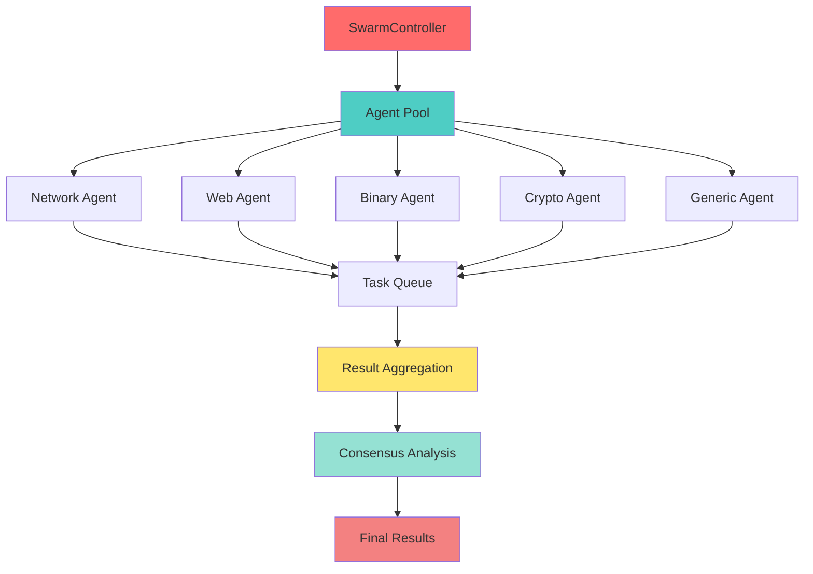

# Neural Swarm Intelligence Module

> "Many minds, one purpose - distributed intelligence for advanced threat detection" — GhostKit Red Team

## Module Overview

The Neural Swarm Intelligence module represents a revolutionary approach to distributed AI-powered threat detection and exploitation. By leveraging a swarm of specialized agents working in parallel, this module can analyze complex security scenarios from multiple perspectives simultaneously, achieving deeper insights than traditional single-threaded analysis.

### Core Capabilities

- **Distributed Analysis** - Multiple specialized agents working in parallel
- **Adaptive Learning** - Agents learn from feedback and improve over time
- **Consensus Building** - Aggregate results from multiple agents for higher confidence
- **Evolutionary Optimization** - Genetic algorithms to evolve better detection strategies
- **Multi-Domain Expertise** - Specialized agents for network, web, binary, and cryptographic analysis

## Technical Architecture

The Neural Swarm module employs a sophisticated multi-agent architecture:



### Agent Specializations

| Agent Type | Focus Area | Capabilities |
|------------|-----------|--------------|
| **Network Agent** | Network traffic analysis | C2 detection, anomalous traffic patterns, port scanning detection |
| **Web Agent** | Web application security | Injection attacks, sensitive endpoint access, authentication bypass |
| **Binary Agent** | Malware and binary analysis | Suspicious API calls, shellcode detection, obfuscation patterns |
| **Crypto Agent** | Cryptographic implementations | Weak algorithms, insufficient key sizes, implementation flaws |
| **Generic Agent** | General-purpose analysis | Fallback for unspecialized tasks |

## Basic Usage

### Command Line Interface

```bash
# Basic analysis with default 5 agents
python ghostkit.py -m neural_swarm --mode analyze --target 192.168.1.0/24

# Analysis with custom agent count
python ghostkit.py -m neural_swarm --mode analyze --target example.com --agents 10

# Evolutionary mode for optimization
python ghostkit.py -m neural_swarm --mode evolve --target scan_data.json --generations 20

# Learning mode with feedback data
python ghostkit.py -m neural_swarm --mode learn --target feedback_dataset.json --agents 8

# Save results to file
python ghostkit.py -m neural_swarm --mode analyze --target 192.168.1.100 --output results.json
```

### Python API Usage

```python
from modules.neural_swarm import SwarmController, NeuralSwarmAgent

# Initialize swarm controller with 5 agents
controller = SwarmController(num_agents=5)
controller.start()

# Submit analysis task
task_data = {
    "packets": [
        {"src_ip": "192.168.1.100", "dst_ip": "10.0.0.5", "dst_port": 4444},
        {"src_ip": "192.168.1.100", "dst_ip": "10.0.0.5", "dst_port": 4444}
    ]
}

task_id = controller.submit_task("analyze", task_data)

# Wait for results
result = controller.get_result(task_id, timeout=30.0)

if result:
    print(f"Confidence: {result['confidence']:.2f}")
    print(f"Anomalies: {result['result']['anomalies']}")

# Stop swarm when done
controller.stop()
```

## Operation Modes

### 1. Analyze Mode

The primary mode for threat detection and vulnerability analysis.

```bash
python ghostkit.py -m neural_swarm --mode analyze --target 192.168.1.0/24 --agents 12
```

**Output:**
```
[*] Starting Neural Swarm Intelligence module in analyze mode
[*] Submitting task to neural swarm with 12 agents
[*] Waiting for swarm to analyze data...
[+] Swarm analysis complete with confidence: 0.85
[*] Analysis Results:
    - Anomalies detected: 3
    - Potential C2 traffic: 2 connections
    - Suspicious web patterns: 5
    - Consensus confidence: 85%
[+] Results saved to results.json
```

### 2. Learn Mode

Train agents on feedback data to improve detection accuracy.

```bash
python ghostkit.py -m neural_swarm --mode learn --target training_data.json --agents 8
```

**Training Data Format:**
```json
{
  "samples": [
    {
      "data": {"packets": [...]},
      "label": "benign",
      "accuracy_feedback": 0.95
    },
    {
      "data": {"requests": [...]},
      "label": "malicious",
      "accuracy_feedback": 0.88
    }
  ]
}
```

### 3. Evolve Mode

Use genetic algorithms to evolve better detection strategies over multiple generations.

```bash
python ghostkit.py -m neural_swarm --mode evolve --target dataset.json --generations 20 --agents 10
```

**Output:**
```
[*] Starting Neural Swarm Intelligence module in evolve mode
[*] Evolution parameters: 20 generations, 10 agents per generation
[*] Generation 1: Average fitness 0.65
[*] Generation 5: Average fitness 0.73
[*] Generation 10: Average fitness 0.81
[*] Generation 15: Average fitness 0.87
[*] Generation 20: Average fitness 0.92
[+] Evolution complete! Best agent fitness: 0.95
[+] Best agent configuration saved to evolved_agent.json
```

## Advanced Features

### Consensus Building

The swarm achieves consensus by aggregating results from multiple agents:

```python
# Example of consensus building in action
controller = SwarmController(num_agents=5)
controller.consensus_threshold = 0.7  # 70% agreement required

# When analyzing suspicious traffic
task_id = controller.submit_task("analyze", network_data)
result = controller.get_result(task_id)

# Result includes consensus metrics
print(f"Agent agreement: {result['consensus_score']:.2%}")
print(f"Contributing agents: {result['agent_count']}")
```

### Custom Agent Configuration

Create specialized agents for specific tasks:

```python
from modules.neural_swarm import NeuralSwarmAgent

# Create custom agent with specific learning rate
custom_agent = NeuralSwarmAgent(
    agent_id="custom_1",
    specialization="web",
    learning_rate=0.05
)

# Configure knowledge base
custom_agent.knowledge_base = {
    "attack_patterns": ["sql_injection", "xss", "csrf"],
    "detection_rules": [...]
}

# Use in swarm
controller.agents["custom_1"] = custom_agent
```

## Integration with Other Modules

The Neural Swarm integrates seamlessly with other GhostKit modules:

### Network Scanner → Neural Swarm

```bash
# First, perform network scan
python ghostkit.py -m network_scanner -t 192.168.1.0/24 -o network_data.json

# Analyze results with neural swarm
python ghostkit.py -m neural_swarm --mode analyze --target network_data.json --agents 10
```

### Web Scanner → Neural Swarm → Exploit Engine

```bash
# Scan web application
python ghostkit.py -m web_scanner -u https://example.com -o web_scan.json

# Analyze with neural swarm
python ghostkit.py -m neural_swarm --mode analyze --target web_scan.json -o swarm_analysis.json

# Use results for targeted exploitation
python ghostkit.py -m exploit_engine --from-file swarm_analysis.json --auto-exploit
```

## Performance Optimization

### Agent Count Tuning

The optimal number of agents depends on your analysis requirements:

| Scenario | Recommended Agents | Reasoning |
|----------|-------------------|-----------|
| Quick scan | 3-5 agents | Fast results, lower resource usage |
| Balanced analysis | 8-10 agents | Good balance of speed and accuracy |
| Deep analysis | 15-20 agents | Maximum coverage and confidence |
| Large-scale assessment | 25+ agents | Parallel processing of large datasets |

### Thread Management

```python
# Configure thread pool size
controller = SwarmController(num_agents=10)
controller.max_concurrent_tasks = 5  # Limit concurrent tasks

# Set timeout for long-running tasks
result = controller.get_result(task_id, timeout=60.0)
```

## Case Study: Advanced Threat Detection

### Scenario: Detecting APT Activity

```bash
# Step 1: Capture network traffic
tcpdump -i eth0 -w traffic.pcap

# Step 2: Convert to analyzable format
python ghostkit.py -m pcap_parser --input traffic.pcap --output traffic.json

# Step 3: Deploy neural swarm for analysis
python ghostkit.py -m neural_swarm --mode analyze --target traffic.json --agents 15 -o apt_analysis.json
```

**Results:**
```json
{
  "status": "success",
  "confidence": 0.89,
  "anomalies": [
    "Potential C2 traffic detected on port 4444",
    "Encrypted payload pattern consistent with known APT groups",
    "Beacon-like communication pattern every 60 seconds"
  ],
  "agent_consensus": 0.87,
  "recommended_actions": [
    "Investigate connections to IP 10.20.30.40",
    "Review firewall logs for similar patterns",
    "Isolate affected hosts immediately"
  ]
}
```

## Dependencies

The Neural Swarm module has optional dependencies for enhanced functionality:

### Required
- Python 3.8+
- NumPy
- Base GhostKit modules

### Optional (for enhanced ML features)
- TensorFlow 2.x - Deep learning capabilities
- scikit-learn - Clustering and classification
- PyTorch - Alternative ML backend

### Installation

```bash
# Install with optional dependencies
pip install numpy tensorflow scikit-learn

# Or install from requirements
pip install -r requirements-ai.txt
```

**Note:** The module will work without optional dependencies but with reduced ML capabilities.

## Best Practices

1. **Start Small** - Begin with fewer agents and scale up as needed
2. **Use Specialized Agents** - Match agent types to your analysis goals
3. **Enable Learning** - Feed results back to improve agent performance
4. **Monitor Resources** - Large swarms can be resource-intensive
5. **Set Appropriate Timeouts** - Complex analysis may require longer timeouts
6. **Validate Results** - Always verify swarm findings with manual analysis
7. **Save Evolved Agents** - Preserve well-performing agent configurations

## MITRE ATT&CK Mapping

| Technique ID | Technique Name | Detection Capability |
|--------------|----------------|---------------------|
| T1071 | Application Layer Protocol | Network agent detects anomalous protocol usage |
| T1090 | Proxy | Multi-agent correlation identifies proxy chains |
| T1048 | Exfiltration Over Alternative Protocol | Pattern recognition for data exfiltration |
| T1132 | Data Encoding | Crypto agent analyzes encoding patterns |
| T1573 | Encrypted Channel | Traffic analysis for C2 communications |
| T1027 | Obfuscated Files or Information | Binary agent detects obfuscation techniques |

## Troubleshooting

| Issue | Possible Cause | Solution |
|-------|----------------|----------|
| Low confidence scores | Insufficient agents or training | Increase agent count, use learn mode |
| High false positive rate | Overly aggressive detection | Adjust consensus threshold higher |
| Slow performance | Too many agents or complex data | Reduce agent count, optimize task size |
| Agent timeout | Long-running analysis | Increase timeout parameter |
| Memory issues | Large dataset + many agents | Process data in batches, reduce agents |

## Performance Metrics

Expected performance characteristics:

- **Throughput**: 1000-5000 events/second (depends on agent count)
- **Latency**: 50-500ms per analysis (varies with complexity)
- **Scalability**: Linear up to ~30 agents, then diminishing returns
- **Memory**: ~50-100MB per agent
- **CPU**: Multi-core scaling, 1-2 cores per agent recommended

## References

- [GhostKit API Documentation](../development/api-reference.md)
- [Performance Tuning Guide](../technical.md)

## Related Modules

- [AI Vulnerability Analyzer](ai-vulnerability-analyzer.md) - ML-based vulnerability detection
- [Network Scanner](../index.md) - Network reconnaissance
- [Threat Intelligence](../advanced/threat-intelligence.md) - Threat data integration

---

*Last updated: November 7, 2025*
